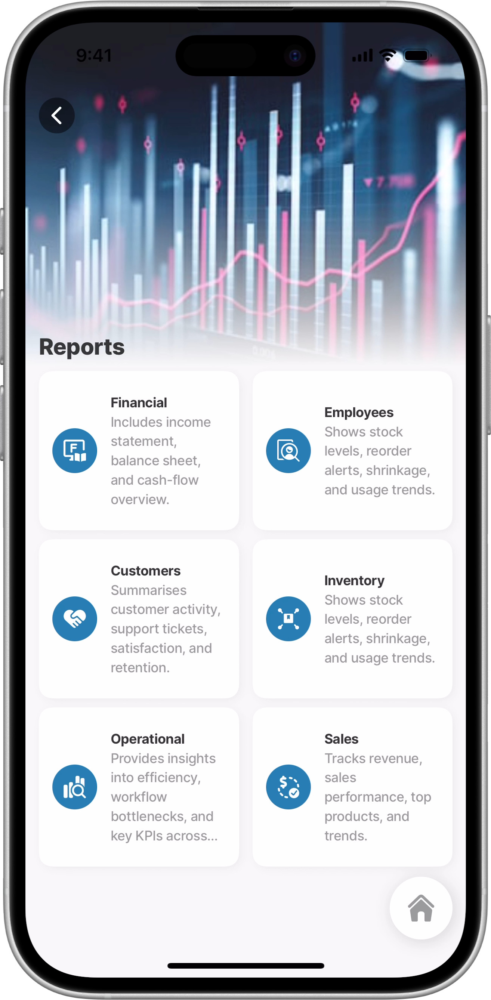
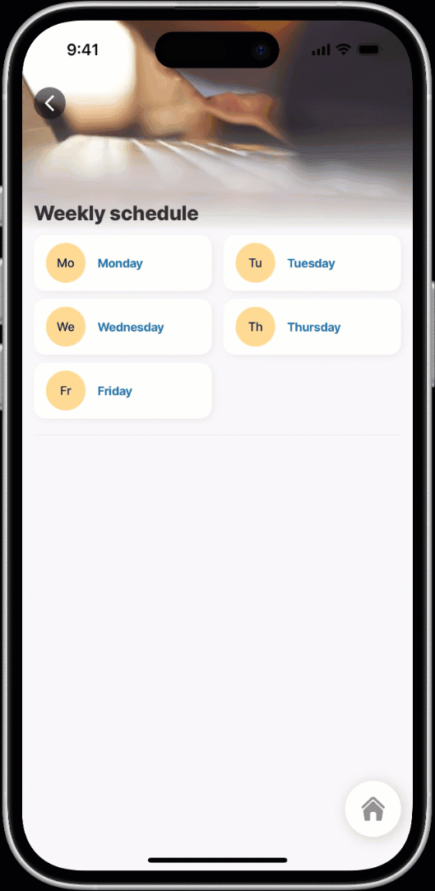
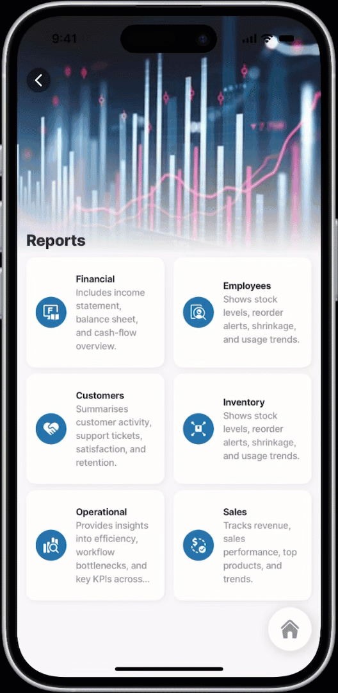
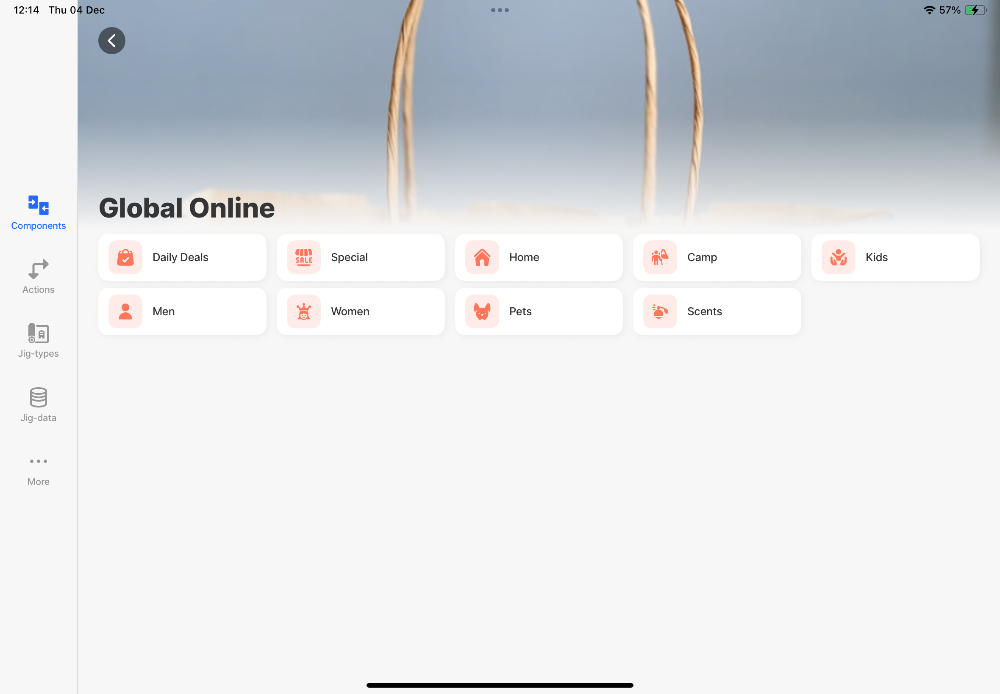
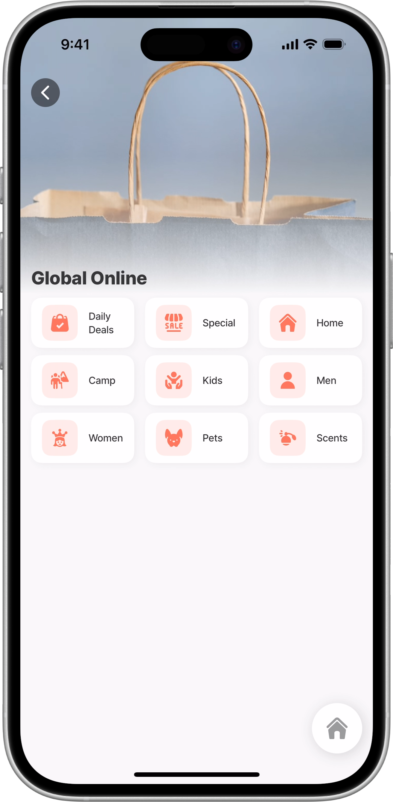

# menu-item



A menu-item is a lightweight list-item designed for quick selection and navigation. It’s ideal for presenting categories, filters, or simple choices that guide you to the next screen or refine the data being displayed. Use a menu-item when you want users to tap an option to view related content, for example, selecting a project, choosing a day of the week, or filtering items by category.



<figure><figcaption></figcaption></figure>



## Configuration options



<table><thead><tr><th width="127.76171875">Core structure</th><th></th></tr></thead><tbody><tr><td><code>title</code></td><td>Add a <code>title</code> for the menu-item. You can use an expression and datasource to set the title. To apply styling, use <code>Text With Formats</code> or <code>Text With Styles</code>.</td></tr></tbody></table>

<table><thead><tr><th width="154.015625">Other options</th><th></th></tr></thead><tbody><tr><td><code>leftElement</code></td><td><p>Set an element to the left of the list. The following elements are available:</p><ul><li><code>avatar</code> - configure the <code>color</code>, <code>size</code>, <code>text</code>, <code>uri</code>, and <code>onPress</code> event.</li><li><code>icon</code> - the icon <code>size</code>, <code>color</code>,<code>shape</code>, <code>type</code>, <code>isSubtle</code> (low opacity), and <code>onPress</code> event is configurable.</li><li><code>image</code> - the image <code>text,</code> <code>uri</code>, <code>size</code>, <code>shape</code>, <code>resizeMode</code>, and <code>onPress</code> event is configurable.</li></ul></td></tr><tr><td><code>numberOfColumns</code></td><td>Sets the number of columns used to display items in a multi-column layout. This applies only to vertical lists; it is ignored when <code>isHorizontal</code> is <code>true</code>. This property is set under the <code>data</code> property.</td></tr><tr><td><code>subtitle</code></td><td>An optional line of secondary text displayed beneath the title. To apply styling, use <code>Text With Formats</code> or <code>Text With Styles</code>.</td></tr></tbody></table>

<table><thead><tr><th width="156.078125">Actions</th><th></th></tr></thead><tbody><tr><td><code>onPress</code></td><td>The action is triggered while pressing on a menu-item in the list. Use IntelliSense (ctrl+space) to see the list of available actions.</td></tr></tbody></table>

## Considerations

* Use menu items primarily for category filtering. A common example is selecting a day of the week to show only the time entries associated with that day.
* The recommended maximum number of columns is 3 on mobile devices and 5 on tablets in landscape for optimal readability and spacing.
* When using an image in the `leftElement` together with `numberOfColumns`, the image may expand to fill the entire column, causing the `title` or `subtitle` to be hidden.
  * For phones, use an avatar with the image to ensure proper rendering.
  * For tablets, using the image property is supported and renders correctly.

## Examples and code snippets

### Menu-item with avatar



This example displays a weekly schedule using a `menu-item` list of weekdays. When you select a day, the jig saves that selection in the `dayFilter` state and immediately loads the list of employees rostered for that day. The top list shows the days of the week as selectable menu-items, and the second list, visible only after a day is chosen, shows the filtered roster with each employee’s name, role, and avatar. This allows you to quickly tap a day and view who is on duty.



<figure><figcaption><p>Menu-item with avatar in two columns</p></figcaption></figure>






```yaml
title: Weekly schedule
type: jig.default

header:
  type: component.jig-header
  options:
    height: small
    children:
      type: component.image
      options:
        source:
          uri: https://images.unsplash.com/photo-1658534983135-d6a899a6dc7e?w=400&auto=format&fit=crop&q=60&ixlib=rb-4.1.0&ixid=M3wxMjA3fDB8MHxzZWFyY2h8NHx8YmFja2dyb3VuZCUyMHdvcmt8ZW58MHx8MHx8fDA%3D

onRefresh:
  type: action.reset-jig-state
  options:
    changes:
      - dayFilter
      
onFocus:
  type: action.reset-jig-state
  options:
    changes:
      - dayFilter
state:
  dayFilter:
    initialValue: ""

children:
  - type: component.list
    instanceId: day-roster
    options:
      data: =@ctx.datasources.week-day
      # Display items in a 2-column layout.
      numberOfColumns: 2
      maximumItemsToRender: 8
      item:
        # Render each day as a clickable menu-item.
        type: component.menu-item
        options:
          # Main styled text display configuration.
          title:
            # Show the day name from the current item.
            text: =@ctx.current.item.day
            fontSize: regular
            color: color1
            isSubtle: false
            isBold: true
            numberOfLines: 1
          # Avatar icon displayed on the left side of each menu-item.  
          leftElement:
            element: avatar
            # Display day name initial(s) in the avatar.
            text: =@ctx.current.item.day
            # Color for avatar background.
            color: color3
          # Action triggered when user taps on a day.  
          onPress:
            # Update the jig state when day is selected.
            type: action.set-jig-state
            options:
              changes:
                # Store selected day in 'dayFilter' state variable.
                dayFilter: =@ctx.current.item.day
 
  - type: component.divider
  - type: component.section
    # Only render this list when a day has been selected (dayFilter exists).
    when: =$boolean(@ctx.jig.state.dayFilter)
    options:
      title:
      # Display the selected day name as a section header.
        text: =@ctx.jig.state.dayFilter & " team"
        fontSize: regular
        isBold: true
        transform: uppercase
      children:  
        # List component to display schedule employees based on selected day. 
        - type: component.list
          # Only render this list when a day has been selected (dayFilter exists).
          when: =$boolean(@ctx.jig.state.dayFilter)
          options:
            data: =@ctx.datasources.roster
            maximumItemsToRender: 8
            item:
              type: component.list-item
              options:
                isContained: true
                # Render each employee on duty for that day as a list item.
                title:
                  text: =@ctx.current.item.TechnicianName
                  fontSize: regular
                  isBold: true
                  transform: uppercase
                # Avatar displayed on the left side of each list item.  
                leftElement:
                  element: avatar
                  text: =@ctx.current.item.TechnicianName
                  uri: =@ctx.current.item.avatar
                label:
                  title: =@ctx.current.item.position
                  color: color1boolean(@ctx.jig.state.dayFilter)
    options:
      title:
      # Display the selected day name as a section header.
        text: =@ctx.jig.state.dayFilter & " team"
        fontSize: regular
        isBold: true
        transform: uppercase
      children:  
         # List component to display schedule employees based on selected day. 
        - type: component.list
          # Only render this list when a day has been selected (dayFilter exists).
          when: =$boolean(@ctx.jig.state.dayFilter)
          options:
            data: =@ctx.datasources.roster
            maximumItemsToRender: 8
            item:
              type: component.list-item
              options:
                isContained: true
                # Render each employee on duty for that day as a list item.
                title:
                  text: =@ctx.current.item.TechnicianName
                  fontSize: regular
                  isBold: true
                  transform: uppercase
                # Avatar displayed on the left side of each list item.  
                leftElement:
                  element: avatar
                  text: =@ctx.current.item.TechnicianName
                  uri: =@ctx.current.item.avatar
                label:
                  title: =@ctx.current.item.position
                  color: color1


```





```yaml
datasources:
  roster:
    type: datasource.sqlite
    options:
      provider: DATA_PROVIDER_DYNAMIC
      entities:
        - default/week-roster
      query: |
        SELECT id,
          '$.TechnicianName',
          '$.Monday',
          '$.Tuesday',
          '$.Wednesday',
          '$.Thursday',
          '$.Friday',
          '$.Notes',
          '$.avatar',
          '$.position'
        FROM [default/week-roster]
        WHERE 
            (@filter = 'Monday' and '$.Monday' != 'Off')
            OR (@filter = 'Tuesday' and '$.Tuesday' != 'Off')
            OR (@filter = 'Wednesday' and '$.Wednesday' != 'Off')
            OR (@filter = 'Thursday' and '$.Thursday' != 'Off')
            OR (@filter = 'Friday' and '$.Friday' != 'Off')

      queryParameters:
        filter: =@ctx.jig.state.dayFilter

  week-day:
    type: datasource.static
    options:
      data:
        - id: 1
          day: Monday
        - id: 2
          day: Tuesday
        - id: 3
          day: Wednesday
        - id: 4
          day: Thursday
        - id: 5
          day: Friday
```




### Menu-item with icons



<figure><figcaption></figcaption></figure>



This example displays a list of company report categories using `menu-items`. Each menu-item represents a report type, such as Financial, Employees, Customers, or Sales and includes an `icon`, a bold `title`, and a short descriptive `subtitle`. The list is shown in two columns (numberOfColumns) for a compact, visual layout. When you taps a menu-item, the app navigates to the corresponding report jig defined by the `myjig` value in the datasource. This layout offers users a simple, intuitive way to browse and open different business reports.






```yaml
title: Reports
type: jig.list
icon: contact

header:
  type: component.jig-header
  options:
    height: medium
    children:
      type: component.image
      options:
        source:
          uri: https://plus.unsplash.com/premium_photo-1681487769650-a0c3fbaed85a?w=400&auto=format&fit=crop&q=60&ixlib=rb-4.1.0&ixid=M3wxMjA3fDB8MHxzZWFyY2h8OXx8cmVwb3J0c3xlbnwwfHwwfHx8MA%3D%3D

datasources:
  categories:
    type: datasource.static
    options:
      data:
        - id: 1
          category: Financial
          description: Includes income statement, balance sheet, and cash-flow overview.
          icon: report-f-grade
          # Specify the jig name that is used for navigation in the go-to action.
          myjig: report-financial
        - id: 2
          category: Employees
          description: Shows stock levels, reorder alerts, shrinkage, and usage trends.
          icon: recruiting-employee-search-document
          myjig: report-employee
        - id: 3
          category: Customers
          description: Summarises customer activity, support tickets, satisfaction, and retention.
          icon: hand-shake-heart
          myjig: report-customer
        - id: 4
          category: Inventory
          description: Shows stock levels, reorder alerts, shrinkage, and usage trends.
          icon: supply-chain-distributor-box-package
          myjig: report-inventory
        - id: 5
          category: Operational
          description: Provides insights into efficiency, workflow bottlenecks, and key KPIs across departments.
          icon: amazon-elastic-service-operational-analytics
          myjig: report-operations
        - id: 6
          category: Sales
          description: Tracks revenue, sales performance, top products, and trends.
          icon: monetization-approve
          myjig: report-sales

data: =@ctx.datasources.categories
# Display items in a 2-column layout.
numberOfColumns: 2
item:
  type: component.menu-item
  options:
    title:
      text: =@ctx.current.item.category
      fontSize: regular
      # color:
      isSubtle: false
      isBold: true
      numberOfLines: 1
      transform: none
    subtitle:
      text: =@ctx.current.item.description
      fontSize: regular
      isSubtle: true
      isBold: false
      numberOfLines: 5
    leftElement:
      element: icon
      icon: =@ctx.current.item.icon
      color: color1
      type: contained
      shape: circle
    # When the menu-item is pressed, navigate to the corresponding report.  
    onPress:
      type: action.go-to
      options:
        # Use the myjig set up in the datasource for navigation. 
        linkTo: =@ctx.current.item.myjig

```




```yaml
title: Financial Report
type: jig.document

source:
  documentType: HTML
  content: |
    <!DOCTYPE html>
    <html lang="en">
    <head>
      <meta charset="UTF-8" />
      <title>Q1 2025 Financial Report</title>
      <style>
        body {
          font-family: Arial, sans-serif;
          line-height: 1.6;
          margin: 20px;
          background-color: #f7f7f7;
          color: #333;
        }

        .report-container {
          max-width: 900px;
          margin: 0 auto;
          background-color: #ffffff;
          padding: 24px 32px;
          border-radius: 8px;
          box-shadow: 0 2px 8px rgba(0,0,0,0.08);
        }

        h1, h2, h3 {
          color: #123456;
          margin-top: 0;
        }

        h1 {
          font-size: 1.8rem;
          margin-bottom: 0.25rem;
        }

        h2 {
          font-size: 1.4rem;
          margin-top: 1.8rem;
        }

        h3 {
          font-size: 1.1rem;
          margin-top: 1rem;
          margin-bottom: 0.4rem;
        }

        .meta {
          font-size: 0.9rem;
          color: #666;
          margin-bottom: 1.5rem;
        }

        p {
          margin: 0.3rem 0 0.8rem 0;
        }

        .section-divider {
          border-top: 1px solid #e0e0e0;
          margin: 1.5rem 0;
        }

        .highlight {
          font-weight: bold;
        }

        table {
          width: 100%;
          border-collapse: collapse;
          margin: 0.5rem 0 1rem 0;
          font-size: 0.95rem;
        }

        th, td {
          text-align: left;
          padding: 8px 10px;
          border-bottom: 1px solid #e0e0e0;
        }

        th {
          background-color: #f0f4fa;
          font-weight: 600;
        }

        .numeric {
          text-align: right;
          white-space: nowrap;
        }

        .subheading {
          font-weight: bold;
          margin-top: 0.6rem;
        }

        ul {
          margin: 0.3rem 0 1rem 1.2rem;
        }

        @media print {
          body {
            background-color: #ffffff;
          }
          .report-container {
            box-shadow: none;
            border-radius: 0;
            margin: 0;
            padding: 0;
          }
        }
      </style>
    </head>
    <body>
      <div class="report-container">
        <header>
          <h1>Q1 2025 Financial Report</h1>
          <div class="meta">
            <div><span class="highlight">Reporting Period:</span> January – March 2025</div>
            <div><span class="highlight">Company Type:</span> Small Business</div>
          </div>
          <div class="section-divider"></div>
        </header>

        <!-- 1. Executive Summary -->
        <section>
          <h2>1. Executive Summary</h2>
          <p>
            The company delivered a stable first quarter with steady revenue growth,
            controlled expenses, and a positive net profit margin. Customer demand
            remained consistent, and operational efficiencies improved compared to
            the previous quarter.
          </p>
        </section>

        <div class="section-divider"></div>

        <!-- 2. Financial Highlights -->
        <section>
          <h2>2. Financial Highlights</h2>

          <h3>Revenue</h3>
          <table>
            <tr>
              <th>Item</th>
              <th class="numeric">Amount (USD)</th>
            </tr>
            <tr>
              <td>Total Revenue</td>
              <td class="numeric">$245,000</td>
            </tr>
            <tr>
              <td>Quarter-over-Quarter Growth</td>
              <td class="numeric">+6%</td>
            </tr>
            <tr>
              <td colspan="2" class="subheading">By Source</td>
            </tr>
            <tr>
              <td>Product Sales</td>
              <td class="numeric">$170,000</td>
            </tr>
            <tr>
              <td>Services</td>
              <td class="numeric">$60,000</td>
            </tr>
            <tr>
              <td>Other Income</td>
              <td class="numeric">$15,000</td>
            </tr>
          </table>

          <h3>Expenses</h3>
          <table>
            <tr>
              <th>Category</th>
              <th class="numeric">Amount (USD)</th>
            </tr>
            <tr>
              <td>Total Operating Expenses</td>
              <td class="numeric">$182,000</td>
            </tr>
            <tr>
              <td>Cost of Goods Sold (COGS)</td>
              <td class="numeric">$95,000</td>
            </tr>
            <tr>
              <td>Salaries &amp; Wages</td>
              <td class="numeric">$45,000</td>
            </tr>
            <tr>
              <td>Marketing &amp; Sales</td>
              <td class="numeric">$12,000</td>
            </tr>
            <tr>
              <td>Rent &amp; Utilities</td>
              <td class="numeric">$10,000</td>
            </tr>
            <tr>
              <td>Software &amp; Subscriptions</td>
              <td class="numeric">$8,000</td>
            </tr>
            <tr>
              <td>Miscellaneous</td>
              <td class="numeric">$12,000</td>
            </tr>
          </table>

          <h3>Gross &amp; Net Profit</h3>
          <table>
            <tr>
              <th>Metric</th>
              <th class="numeric">Value</th>
            </tr>
            <tr>
              <td>Gross Profit</td>
              <td class="numeric">$150,000</td>
            </tr>
            <tr>
              <td>Gross Margin</td>
              <td class="numeric">61%</td>
            </tr>
            <tr>
              <td>Net Profit</td>
              <td class="numeric">$63,000</td>
            </tr>
            <tr>
              <td>Net Margin</td>
              <td class="numeric">26%</td>
            </tr>
          </table>
        </section>

        <div class="section-divider"></div>

        <!-- 3. Cash Flow Overview -->
        <section>
          <h2>3. Cash Flow Overview</h2>

          <h3>Cash Inflows</h3>
          <table>
            <tr>
              <th>Source</th>
              <th class="numeric">Amount (USD)</th>
            </tr>
            <tr>
              <td>Operating Activities</td>
              <td class="numeric">$210,000</td>
            </tr>
            <tr>
              <td>Financing Activities</td>
              <td class="numeric">$0</td>
            </tr>
            <tr>
              <td>Investing Activities (net)</td>
              <td class="numeric">- $5,000</td>
            </tr>
          </table>

          <h3>Cash Outflows</h3>
          <table>
            <tr>
              <th>Type</th>
              <th class="numeric">Amount (USD)</th>
            </tr>
            <tr>
              <td>Operating Outflows</td>
              <td class="numeric">$165,000</td>
            </tr>
          </table>

          <h3>Net Cash Position</h3>
          <table>
            <tr>
              <th>Item</th>
              <th class="numeric">Amount (USD)</th>
            </tr>
            <tr>
              <td>Opening Cash Balance</td>
              <td class="numeric">$40,000</td>
            </tr>
            <tr>
              <td>Closing Cash Balance</td>
              <td class="numeric">$80,000</td>
            </tr>
          </table>
        </section>

        <div class="section-divider"></div>

        <!-- 4. Operational Insights -->
        <section>
          <h2>4. Operational Insights</h2>
          <ul>
            <li>Increased customer acquisition from improved marketing campaigns.</li>
            <li>Inventory turnover improved with better stock forecasting.</li>
            <li>Digital tools reduced manual workload, lowering administrative costs.</li>
          </ul>
        </section>

        <div class="section-divider"></div>

        <!-- 5. Outlook -->
        <section>
          <h2>5. Outlook for Q2 2025</h2>
          <ul>
            <li>Projected revenue growth of 5–8% driven by seasonal demand.</li>
            <li>Planned investment in customer support and expanded service offerings.</li>
            <li>Continued focus on operational efficiency and reducing overhead.</li>
          </ul>
        </section>
      </div>
    </body>
    </html>

```




```yaml
title: Employee/Workforce Report
type: jig.document

source:
  documentType: HTML
  content: |
    <!DOCTYPE html>
    <html lang="en">
    <head>
      <meta charset="UTF-8" />
      <title>Q1 2025 Workforce Report</title>
      <style>
        body {
          font-family: Arial, sans-serif;
          line-height: 1.6;
          margin: 20px;
          background-color: #f7f7f7;
          color: #333;
        }

        .report-container {
          max-width: 900px;
          margin: 0 auto;
          background-color: #ffffff;
          padding: 24px 32px;
          border-radius: 8px;
          box-shadow: 0 2px 8px rgba(0,0,0,0.08);
        }

        h1, h2, h3 {
          color: #123456;
          margin-top: 0;
        }

        h1 {
          font-size: 1.8rem;
          margin-bottom: 0.25rem;
        }

        h2 {
          font-size: 1.4rem;
          margin-top: 1.8rem;
        }

        h3 {
          font-size: 1.1rem;
          margin-top: 1rem;
          margin-bottom: 0.4rem;
        }

        .meta {
          font-size: 0.9rem;
          color: #666;
          margin-bottom: 1.5rem;
        }

        p {
          margin: 0.3rem 0 0.8rem 0;
        }

        .section-divider {
          border-top: 1px solid #e0e0e0;
          margin: 1.5rem 0;
        }

        .highlight {
          font-weight: bold;
        }

        ul {
          margin: 0.3rem 0 1rem 1.2rem;
        }

        .metrics-grid {
          display: grid;
          grid-template-columns: repeat(auto-fit, minmax(220px, 1fr));
          gap: 12px;
          margin: 0.5rem 0 1rem 0;
        }

        .metric-card {
          background-color: #f5f8fd;
          border-radius: 6px;
          padding: 10px 12px;
          border: 1px solid #e0e6f2;
          font-size: 0.95rem;
        }

        .metric-label {
          font-size: 0.8rem;
          text-transform: uppercase;
          letter-spacing: 0.03em;
          color: #777;
        }

        .metric-value {
          font-size: 1.2rem;
          font-weight: bold;
          margin-top: 4px;
        }

        .metric-note {
          font-size: 0.85rem;
          color: #555;
          margin-top: 4px;
        }

        @media print {
          body {
            background-color: #ffffff;
          }
          .report-container {
            box-shadow: none;
            border-radius: 0;
            margin: 0;
            padding: 0;
          }
        }
      </style>
    </head>
    <body>
      <div class="report-container">
        <header>
          <h1>Q1 2025 Workforce Report</h1>
          <div class="meta">
            <div><span class="highlight">Focus Areas:</span> Attendance • Scheduling • Productivity • HR Metrics</div>
            <div><span class="highlight">Reporting Period:</span> January – March 2025</div>
          </div>
          <div class="section-divider"></div>
        </header>

        <!-- 1. Summary -->
        <section>
          <h2>1. Summary</h2>
          <p>
            Q1 2025 showed strong workforce stability, improved attendance, and steady productivity levels
            across teams. Scheduling compliance improved, and employee engagement remained positive.
            HR indicators suggest a healthy and well-supported workforce with low turnover.
          </p>
        </section>

        <div class="section-divider"></div>

        <!-- 2. Attendance Highlights -->
        <section>
          <h2>2. Attendance Highlights</h2>

          <div class="metrics-grid">
            <div class="metric-card">
              <div class="metric-label">Overall Attendance Rate</div>
              <div class="metric-value">96%</div>
              <div class="metric-note">Across all teams</div>
            </div>
            <div class="metric-card">
              <div class="metric-label">Late Arrivals</div>
              <div class="metric-value">-12%</div>
              <div class="metric-note">vs. Q4 2024</div>
            </div>
            <div class="metric-card">
              <div class="metric-label">Unplanned Absences</div>
              <div class="metric-value">1.3 days</div>
              <div class="metric-note">Average per employee</div>
            </div>
            <div class="metric-card">
              <div class="metric-label">Top Performing Team</div>
              <div class="metric-value">Field Ops</div>
              <div class="metric-note">98% attendance</div>
            </div>
          </div>

          <p><span class="highlight">Key Insight:</span> Improved attendance was linked to clearer scheduling and better communication of shift changes.</p>
        </section>

        <div class="section-divider"></div>

        <!-- 3. Scheduling Overview -->
        <section>
          <h2>3. Scheduling Overview</h2>

          <div class="metrics-grid">
            <div class="metric-card">
              <div class="metric-label">Shift Coverage</div>
              <div class="metric-value">99%</div>
              <div class="metric-note">Scheduled shifts filled</div>
            </div>
            <div class="metric-card">
              <div class="metric-label">Schedule Compliance</div>
              <div class="metric-value">93%</div>
              <div class="metric-note">Planned vs. actual</div>
            </div>
            <div class="metric-card">
              <div class="metric-label">Last-Minute Changes</div>
              <div class="metric-value">-15%</div>
              <div class="metric-note">Fewer urgent edits</div>
            </div>
            <div class="metric-card">
              <div class="metric-label">Digital Scheduling Use</div>
              <div class="metric-value">78%</div>
              <div class="metric-note">Teams using digital tools</div>
            </div>
          </div>

          <p><span class="highlight">Note:</span> Teams adopting automated scheduling had fewer conflicts and better on-time attendance.</p>
        </section>

        <div class="section-divider"></div>

        <!-- 4. Productivity Metrics -->
        <section>
          <h2>4. Productivity Metrics</h2>

          <div class="metrics-grid">
            <div class="metric-card">
              <div class="metric-label">Productivity Index</div>
              <div class="metric-value">88 / 100</div>
              <div class="metric-note">Overall efficiency score</div>
            </div>
            <div class="metric-card">
              <div class="metric-label">Tasks per Employee</div>
              <div class="metric-value">142</div>
              <div class="metric-note">Completed in the quarter</div>
            </div>
            <div class="metric-card">
              <div class="metric-label">On-Time Completion</div>
              <div class="metric-value">91%</div>
              <div class="metric-note">Tasks completed on schedule</div>
            </div>
            <div class="metric-card">
              <div class="metric-label">Downtime Reduction</div>
              <div class="metric-value">+7%</div>
              <div class="metric-note">Less idle time</div>
            </div>
          </div>

          <p><span class="highlight">Drivers of Productivity:</span></p>
          <ul>
            <li>More streamlined workflows.</li>
            <li>Better access to mobile tools and job information.</li>
            <li>Improved cross-team coordination.</li>
          </ul>
        </section>

        <div class="section-divider"></div>

        <!-- 5. HR & People Metrics -->
        <section>
          <h2>5. HR &amp; People Metrics</h2>

          <div class="metrics-grid">
            <div class="metric-card">
              <div class="metric-label">Employee Count</div>
              <div class="metric-value">42</div>
              <div class="metric-note">Active employees</div>
            </div>
            <div class="metric-card">
              <div class="metric-label">New Hires</div>
              <div class="metric-value">3</div>
              <div class="metric-note">Onboarded in Q1</div>
            </div>
            <div class="metric-card">
              <div class="metric-label">Departures</div>
              <div class="metric-value">1</div>
              <div class="metric-note">Voluntary exit</div>
            </div>
            <div class="metric-card">
              <div class="metric-label">Turnover Rate</div>
              <div class="metric-value">2.3%</div>
              <div class="metric-note">Quarterly</div>
            </div>
            <div class="metric-card">
              <div class="metric-label">Training Hours</div>
              <div class="metric-value">120</div>
              <div class="metric-note">Total delivered</div>
            </div>
            <div class="metric-card">
              <div class="metric-label">Satisfaction Score</div>
              <div class="metric-value">4.5 / 5</div>
              <div class="metric-note">From internal survey</div>
            </div>
          </div>

          <p>
            <span class="highlight">Insight:</span>
            Employees expressed strong confidence in leadership communication and in the tools provided for daily work.
          </p>
        </section>

        <div class="section-divider"></div>

        <!-- 6. Key Opportunities -->
        <section>
          <h2>6. Key Opportunities for Q2 2025</h2>
          <ul>
            <li>Expand digital scheduling to remaining teams.</li>
            <li>Increase training in mobile workflows to boost productivity further.</li>
            <li>Implement a recognition program for high-performing individuals and teams.</li>
            <li>Review shift patterns to reduce peak-hour pressure.</li>
          </ul>
        </section>

        <div class="section-divider"></div>

        <!-- 7. Closing Note -->
        <section>
          <h2>7. Closing Note</h2>
          <p>
            The workforce demonstrated resilience and effectiveness in Q1, with positive trends across attendance,
            scheduling, and productivity. Continued investment in people, tools, and training will help sustain
            this momentum into Q2 and beyond.
          </p>
        </section>
      </div>
    </body>
    </html>

```




```yaml
title: Customers
type: jig.document

source:
  documentType: HTML
  content: |
    <!DOCTYPE html>
    <html lang="en">
    <head>
      <meta charset="UTF-8" />
      <title>Q1 2025 Customer Report</title>
      <style>
        body {
          font-family: Arial, sans-serif;
          line-height: 1.6;
          margin: 20px;
          background-color: #f7f7f7;
          color: #333;
        }

        .report-container {
          max-width: 900px;
          margin: 0 auto;
          background-color: #ffffff;
          padding: 24px 32px;
          border-radius: 8px;
          box-shadow: 0 2px 8px rgba(0,0,0,0.08);
        }

        h1, h2, h3 {
          color: #123456;
          margin-top: 0;
        }

        h1 {
          font-size: 1.8rem;
          margin-bottom: 0.25rem;
        }

        h2 {
          font-size: 1.4rem;
          margin-top: 1.8rem;
        }

        .meta {
          font-size: 0.9rem;
          color: #666;
          margin-bottom: 1.5rem;
        }

        .section-divider {
          border-top: 1px solid #e0e0e0;
          margin: 1.5rem 0;
        }

        .highlight {
          font-weight: bold;
        }

        ul {
          margin: 0.3rem 0 1rem 1.2rem;
        }

        .metrics-grid {
          display: grid;
          grid-template-columns: repeat(auto-fit, minmax(220px, 1fr));
          gap: 12px;
          margin: 0.5rem 0 1rem 0;
        }

        .metric-card {
          background-color: #f5f8fd;
          border-radius: 6px;
          padding: 10px 12px;
          border: 1px solid #e0e6f2;
          font-size: 0.95rem;
        }

        .metric-label {
          font-size: 0.8rem;
          text-transform: uppercase;
          letter-spacing: 0.03em;
          color: #777;
        }

        .metric-value {
          font-size: 1.2rem;
          font-weight: bold;
          margin-top: 4px;
        }

        .metric-note {
          font-size: 0.85rem;
          color: #555;
          margin-top: 4px;
        }

        @media print {
          body {
            background-color: #ffffff;
          }
          .report-container {
            box-shadow: none;
            border-radius: 0;
            margin: 0;
            padding: 0;
          }
        }
      </style>
    </head>
    <body>
      <div class="report-container">
        <header>
          <h1>Q1 2025 Customer Report</h1>
          <div class="meta">
            <div><span class="highlight">Focus:</span> Customer Growth • Engagement • Satisfaction • Support Trends</div>
            <div><span class="highlight">Reporting Period:</span> January – March 2025</div>
          </div>
          <div class="section-divider"></div>
        </header>

        <!-- 1. Summary -->
        <section>
          <h2>1. Summary</h2>
          <p>
            Q1 2025 showed healthy growth in the customer base, strong engagement with products and services,
            and an increase in repeat business. Customer satisfaction remained high, with support tickets resolved
            faster than in previous quarters.
          </p>
        </section>

        <div class="section-divider"></div>

        <!-- 2. Customer Growth -->
        <section>
          <h2>2. Customer Growth</h2>

          <div class="metrics-grid">
            <div class="metric-card">
              <div class="metric-label">Active Customers</div>
              <div class="metric-value">1,240</div>
              <div class="metric-note">Across all segments</div>
            </div>
            <div class="metric-card">
              <div class="metric-label">New Customers</div>
              <div class="metric-value">185</div>
              <div class="metric-note">Added in Q1</div>
            </div>
            <div class="metric-card">
              <div class="metric-label">Growth Rate</div>
              <div class="metric-value">+8%</div>
              <div class="metric-note">Quarter-over-quarter</div>
            </div>
            <div class="metric-card">
              <div class="metric-label">Retention Rate</div>
              <div class="metric-value">92%</div>
              <div class="metric-note">Strong customer loyalty</div>
            </div>
          </div>

          <p>
            <span class="highlight">Insight:</span>
            Referrals accounted for 27% of new customers, showing strong word-of-mouth trust.
          </p>
        </section>

        <div class="section-divider"></div>

        <!-- 3. Customer Engagement -->
        <section>
          <h2>3. Customer Engagement</h2>

          <div class="metrics-grid">
            <div class="metric-card">
              <div class="metric-label">Product Usage</div>
              <div class="metric-value">+11%</div>
              <div class="metric-note">Increase in activity</div>
            </div>
            <div class="metric-card">
              <div class="metric-label">Repeat Purchases</div>
              <div class="metric-value">46%</div>
              <div class="metric-note">Customers returning</div>
            </div>
            <div class="metric-card">
              <div class="metric-label">Top Segment</div>
              <div class="metric-value">SMBs</div>
              <div class="metric-note">Most engaged customers</div>
            </div>
            <div class="metric-card">
              <div class="metric-label">Primary Touchpoint</div>
              <div class="metric-value">62%</div>
              <div class="metric-note">Mobile app interactions</div>
            </div>
          </div>

          <p><span class="highlight">Key Drivers:</span></p>
          <ul>
            <li>Improved onboarding experience.</li>
            <li>More timely communication.</li>
            <li>New feature releases driving engagement.</li>
          </ul>
        </section>

        <div class="section-divider"></div>

        <!-- 4. Customer Satisfaction -->
        <section>
          <h2>4. Customer Satisfaction</h2>

          <div class="metrics-grid">
            <div class="metric-card">
              <div class="metric-label">Satisfaction Score</div>
              <div class="metric-value">4.6 / 5</div>
              <div class="metric-note">Overall customer rating</div>
            </div>
            <div class="metric-card">
              <div class="metric-label">NPS</div>
              <div class="metric-value">+52</div>
              <div class="metric-note">Strong promoter base</div>
            </div>
          </div>

          <p><span class="highlight">Most Praised Areas:</span></p>
          <ul>
            <li>Ease of use</li>
            <li>Friendly support</li>
            <li>Reliability</li>
          </ul>

          <p><span class="highlight">Challenges Identified:</span></p>
          <ul>
            <li>Requests for more customization options.</li>
            <li>Occasional delays in response during peak times.</li>
          </ul>
        </section>

        <div class="section-divider"></div>

        <!-- 5. Support & Service Trends -->
        <section>
          <h2>5. Support & Service Trends</h2>

          <div class="metrics-grid">
            <div class="metric-card">
              <div class="metric-label">Support Tickets</div>
              <div class="metric-value">312</div>
              <div class="metric-note">Submitted in Q1</div>
            </div>
            <div class="metric-card">
              <div class="metric-label">Avg Resolution Time</div>
              <div class="metric-value">3.8 hrs</div>
              <div class="metric-note">Faster than Q4</div>
            </div>
            <div class="metric-card">
              <div class="metric-label">FCR Rate</div>
              <div class="metric-value">78%</div>
              <div class="metric-note">Resolved on first contact</div>
            </div>
          </div>

          <p><span class="highlight">Top Ticket Categories:</span></p>
          <ul>
            <li>Login & access issues</li>
            <li>Billing questions</li>
            <li>Feature guidance</li>
          </ul>

          <p>
            <span class="highlight">Observation:</span>
            Ticket volume decreased by 9% vs. Q4, reflecting improved stability and better self-help resources.
          </p>
        </section>

        <div class="section-divider"></div>

        <!-- 6. Opportunities -->
        <section>
          <h2>6. Opportunities for Q2 2025</h2>
          <ul>
            <li>Introduce customer education sessions and micro-tutorials.</li>
            <li>Improve feature discoverability in the mobile app.</li>
            <li>Expand the self-service help center.</li>
            <li>Strengthen early-customer retention programs.</li>
          </ul>
        </section>

        <div class="section-divider"></div>

        <!-- 7. Closing Note -->
        <section>
          <h2>7. Closing Note</h2>
          <p>
            Q1 demonstrated strong customer loyalty, meaningful engagement, and positive sentiment.
            Continued focus on customer experience and support efficiency will help accelerate growth into Q2.
          </p>
        </section>
      </div>
    </body>
    </html>

```




```yaml
title: Sales
type: jig.document

source:
  documentType: HTML
  content: |
    <!DOCTYPE html>
    <html lang="en">
    <head>
      <meta charset="UTF-8" />
      <title>Q1 2025 Sales Report – By Region</title>
      <script src="https://cdn.jsdelivr.net/npm/chart.js"></script>

      <style>
        body {
          font-family: Arial, sans-serif;
          line-height: 1.6;
          margin: 20px;
          background-color: #f7f7f7;
          color: #333;
        }

        .report-container {
          max-width: 900px;
          margin: 0 auto;
          background-color: #ffffff;
          padding: 24px 32px;
          border-radius: 8px;
          box-shadow: 0 2px 8px rgba(0,0,0,0.08);
        }

        h1, h2, h3 {
          color: #123456;
          margin-top: 0;
        }

        h1 {
          font-size: 1.8rem;
        }

        h2 {
          font-size: 1.4rem;
          margin-top: 1.6rem;
        }

        h3 {
          font-size: 1.15rem;
          margin-top: 1.4rem;
        }

        .section-divider {
          border-top: 1px solid #e0e0e0;
          margin: 1.4rem 0;
        }

        .metric {
          margin-left: 12px;
          margin-bottom: 6px;
        }

        .chart-wrapper {
          margin: 30px 0;
          padding: 20px;
          background: #f5f8fd;
          border-radius: 8px;
          border: 1px solid #e0e6f2;
        }

        @media print {
          body {
            background-color: #ffffff;
          }
          .report-container {
            box-shadow: none;
            border-radius: 0;
          }
        }
      </style>
    </head>

    <body>
      <div class="report-container">

        <h1>Q1 2025 Sales Report – By Region</h1>
        <p>A simple overview of sales performance across all regions for the first quarter.</p>

        <div class="section-divider"></div>

        <!-- Section: Regional Sales Overview -->
        <section>
          <h2>1. Regional Sales Overview</h2>

          <h3>North Region</h3>
          <div class="metric">Total Sales: <strong>$520,000</strong></div>
          <div class="metric">Growth: <strong>+7%</strong> vs Q4</div>
          <div class="metric">Top Products: Product A, Product C</div>
          <div class="metric">Insight: Strong retail demand and returning customers</div>

          <h3>South Region</h3>
          <div class="metric">Total Sales: <strong>$410,000</strong></div>
          <div class="metric">Growth: <strong>+4%</strong> vs Q4</div>
          <div class="metric">Top Products: Product B, Product D</div>
          <div class="metric">Insight: Stable performance with rising wholesale orders</div>

          <h3>East Region</h3>
          <div class="metric">Total Sales: <strong>$305,000</strong></div>
          <div class="metric">Growth: <strong>+2%</strong> vs Q4</div>
          <div class="metric">Top Products: Product A, Product E</div>
          <div class="metric">Insight: Logistics delays affected early-quarter performance</div>

          <h3>West Region</h3>
          <div class="metric">Total Sales: <strong>$265,000</strong></div>
          <div class="metric">Growth: <strong>+5%</strong> vs Q4</div>
          <div class="metric">Top Products: Product C, Product F</div>
          <div class="metric">Insight: Growth supported by new marketing campaigns</div>

          <h3>Central Region</h3>
          <div class="metric">Total Sales: <strong>$350,000</strong></div>
          <div class="metric">Growth: <strong>+3%</strong> vs Q4</div>
          <div class="metric">Top Products: Product B, Product C</div>
          <div class="metric">Insight: Strong enterprise customer base driving consistency</div>
        </section>

        <div class="section-divider"></div>

        <!-- BAR CHART SECTION -->
        <section>
          <h2>Bar Chart: Sales by Region</h2>

          <div class="chart-wrapper">
            <canvas id="salesChart"></canvas>
          </div>
        </section>

        <script>
          const ctx = document.getElementById('salesChart').getContext('2d');

          new Chart(ctx, {
            type: 'bar',
            data: {
              labels: ['North', 'South', 'East', 'West', 'Central'],
              datasets: [{
                label: 'Sales ($)',
                data: [520000, 410000, 305000, 265000, 350000],
                backgroundColor: [
                  '#123456',
                  '#1e5799',
                  '#2980b9',
                  '#35adff',
                  '#6bb9f0'
                ],
                borderColor: '#0f2a45',
                borderWidth: 1
              }]
            },
            options: {
              plugins: { legend: { display: false }},
              scales: {
                y: {
                  beginAtZero: true,
                  ticks: {
                    callback: function(value) {
                      return '$' + value.toLocaleString();
                    }
                  },
                  title: {
                    display: true,
                    text: 'Sales (USD)'
                  }
                },
                x: {
                  title: {
                    display: true,
                    text: 'Region'
                  }
                }
              }
            }
          });
        </script>

        <div class="section-divider"></div>

        <!-- Totals Section -->
        <section>
          <h2>2. Total Sales Summary</h2>
          <ul>
            <li><strong>Total Q1 Sales:</strong> $1,850,000</li>
            <li><strong>Overall Growth:</strong> +4.3%</li>
            <li><strong>Best Performing Region:</strong> North</li>
            <li><strong>Region with Improvement Opportunity:</strong> East</li>
          </ul>
        </section>

        <div class="section-divider"></div>

        <!-- Insight Section -->
        <section>
          <h2>3. Quick Insight</h2>
          <p>
            Regional sales remained balanced with strong momentum in the North and South.
            East region sales are expected to improve in Q2 as supply and logistics issues stabilize.
          </p>
        </section>

      </div>
    </body>
    </html>

```





```yaml
title: Inventory
type: jig.document

source:
  documentType: HTML
  content: |
    <!DOCTYPE html>
    <html lang="en">
    <head>
      <meta charset="UTF-8" />
      <title>Q1 2025 Inventory Report</title>
      <style>
        body {
          font-family: Arial, sans-serif;
          line-height: 1.6;
          margin: 20px;
          background-color: #f7f7f7;
          color: #333;
        }

        .report-container {
          max-width: 800px;
          margin: 0 auto;
          background-color: #ffffff;
          padding: 24px 32px;
          border-radius: 8px;
          box-shadow: 0 2px 8px rgba(0,0,0,0.08);
        }

        h1, h2 {
          color: #123456;
          margin-top: 0;
        }

        h1 {
          font-size: 1.8rem;
        }

        h2 {
          font-size: 1.3rem;
          margin-top: 1.6rem;
        }

        .section-divider {
          border-top: 1px solid #e0e0e0;
          margin: 1.4rem 0;
        }

        .metric-box {
          background-color: #f5f8fd;
          border: 1px solid #e0e6f2;
          border-radius: 6px;
          padding: 14px 16px;
          margin-bottom: 12px;
        }

        .metric-title {
          font-size: 0.9rem;
          text-transform: uppercase;
          color: #777;
          letter-spacing: 0.03em;
        }

        .metric-value {
          font-size: 1.4rem;
          font-weight: bold;
          margin-top: 4px;
          color: #123456;
        }

        ul {
          margin: 0.4rem 0 1rem 1.3rem;
        }

        p {
          margin: 0.3rem 0 1rem 0;
        }

        @media print {
          body {
            background-color: #ffffff;
          }
          .report-container {
            box-shadow: none;
            border-radius: 0;
          }
        }
      </style>
    </head>

    <body>
      <div class="report-container">
        <h1>Q1 2025 Inventory Report</h1>
        <p>A simple overview of inventory movement for the first quarter.</p>

        <div class="section-divider"></div>

        <!-- Key Metrics -->
        <section>
          <h2>1. Key Inventory Metrics</h2>

          <div class="metric-box">
            <div class="metric-title">Opening Stock (Jan 1, 2025)</div>
            <div class="metric-value">$184,000</div>
          </div>

          <div class="metric-box">
            <div class="metric-title">Closing Stock (Mar 31, 2025)</div>
            <div class="metric-value">$176,500</div>
          </div>

          <div class="metric-box">
            <div class="metric-title">Stock Received</div>
            <div class="metric-value">$92,300</div>
          </div>

          <div class="metric-box">
            <div class="metric-title">Stock Sold / Used</div>
            <div class="metric-value">$99,800</div>
          </div>

          <div class="metric-box">
            <div class="metric-title">Inventory Turnover</div>
            <div class="metric-value">3.2×</div>
          </div>
        </section>

        <div class="section-divider"></div>

        <!-- Best Performing Items -->
        <section>
          <h2>2. Best-Performing Items</h2>
          <ul>
            <li>Item A – Sold out twice</li>
            <li>Item B – Turnover rate 4.1</li>
            <li>Item C – Strong repeat demand</li>
          </ul>
        </section>

        <div class="section-divider"></div>

        <!-- Slow-Moving Items -->
        <section>
          <h2>3. Slow-Moving Items</h2>
          <ul>
            <li>Item D – Minimal sales</li>
            <li>Item E – Long holding time</li>
            <li><strong>Recommendation:</strong> Consider clearance or reduced orders</li>
          </ul>
        </section>

        <div class="section-divider"></div>

        <!-- Stock Issues -->
        <section>
          <h2>4. Stock Issues Noted</h2>
          <ul>
            <li>Stockouts reduced by 20% vs Q4 due to better forecasting</li>
            <li>Two items overstocked — reorder levels need adjustment</li>
          </ul>
        </section>

        <div class="section-divider"></div>

        <!-- Insight -->
        <section>
          <h2>5. Quick Insight</h2>
          <p>
            Inventory remained balanced in Q1. Strong turnover of core items supported healthy cash flow,
            while improved forecasting reduced stockouts. Q2 should focus on optimizing slow-moving stock
            and fine-tuning reorder points.
          </p>
        </section>
      </div>
    </body>
    </html>

```





```yaml
title: Operations
type: jig.document

source:
  documentType: HTML
  content: |
    <!DOCTYPE html>
    <html lang="en">
    <head>
      <meta charset="UTF-8" />
      <title>Q1 2025 Operations Report</title>
      <style>
        body {
          font-family: Arial, sans-serif;
          line-height: 1.6;
          margin: 20px;
          background-color: #f7f7f7;
          color: #333;
        }

        .report-container {
          max-width: 800px;
          margin: 0 auto;
          background-color: #ffffff;
          padding: 24px 32px;
          border-radius: 8px;
          box-shadow: 0 2px 8px rgba(0,0,0,0.08);
        }

        h1, h2 {
          color: #123456;
          margin-top: 0;
        }

        h1 {
          font-size: 1.8rem;
        }

        h2 {
          font-size: 1.3rem;
          margin-top: 1.6rem;
        }

        .section-divider {
          border-top: 1px solid #e0e0e0;
          margin: 1.4rem 0;
        }

        .metric-box {
          background-color: #f5f8fd;
          border: 1px solid #e0e6f2;
          border-radius: 6px;
          padding: 14px 16px;
          margin-bottom: 12px;
        }

        .metric-title {
          font-size: 0.9rem;
          text-transform: uppercase;
          color: #777;
          letter-spacing: 0.03em;
        }

        .metric-value {
          font-size: 1.4rem;
          font-weight: bold;
          margin-top: 4px;
          color: #123456;
        }

        ul {
          margin: 0.4rem 0 1rem 1.3rem;
        }

        p {
          margin: 0.3rem 0 1rem 0;
        }

        @media print {
          body {
            background-color: #ffffff;
          }
          .report-container {
            box-shadow: none;
            border-radius: 0;
          }
        }
      </style>
    </head>

    <body>
      <div class="report-container">
        <h1>Q1 2025 Operations Report</h1>
        <p>A simple overview of operational performance during the first quarter.</p>

        <div class="section-divider"></div>

        <!-- Key Metrics -->
        <section>
          <h2>1. Key Operational Metrics</h2>

          <div class="metric-box">
            <div class="metric-title">Orders Processed</div>
            <div class="metric-value">1,420</div>
          </div>

          <div class="metric-box">
            <div class="metric-title">On-Time Delivery</div>
            <div class="metric-value">94%</div>
          </div>

          <div class="metric-box">
            <div class="metric-title">Operational Efficiency</div>
            <div class="metric-value">87%</div>
          </div>

          <div class="metric-box">
            <div class="metric-title">Downtime Recorded</div>
            <div class="metric-value">4.5 hours</div>
          </div>
        </section>

        <div class="section-divider"></div>

        <!-- Quality & Accuracy -->
        <section>
          <h2>2. Quality & Accuracy</h2>
          <ul>
            <li><strong>Error Rate:</strong> 1.8% (packing or data errors)</li>
            <li><strong>Returns Due to Operational Issues:</strong> 12 items</li>
            <li><strong>Customer Complaints Related to Operations:</strong> Down 15% vs Q4</li>
          </ul>
        </section>

        <div class="section-divider"></div>

        <!-- Bottlenecks -->
        <section>
          <h2>3. Bottlenecks Identified</h2>
          <ul>
            <li>Occasional delays in supplier delivery.</li>
            <li>Manual steps slowing processing of certain order types.</li>
            <li>High-traffic days creating short-term backlog.</li>
          </ul>
        </section>

        <div class="section-divider"></div>

        <!-- Improvements -->
        <section>
          <h2>4. Improvements Implemented in Q1</h2>
          <ul>
            <li>Introduced better scheduling for high-volume days.</li>
            <li>Improved stock visibility for warehouse teams.</li>
            <li>Added automated checks to reduce packing errors.</li>
          </ul>
        </section>

        <div class="section-divider"></div>

        <!-- Insight -->
        <section>
          <h2>5. Quick Insight</h2>
          <p>
            Q1 operations were stable and efficient. With low downtime and improved accuracy,
            the team is positioned to further increase productivity in Q2.
          </p>
        </section>
      </div>
    </body>
    </html>

```




### Menu-item with columns per device type


{% column width="58.333333333333336%" %}
<figure><figcaption><p>Five column layout for tablets</p></figcaption></figure>


{% column width="41.666666666666664%" %}
<figure><figcaption><p>Three column layout for phone</p></figcaption></figure>



This example displays online-shop categories using `menu-items`. The number of columns (`numberOfColumns`) adjusts dynamically depending on the device type, showing three columns on mobile and 5 on tablets, to optimise space and readability. Each menu-item includes an `icon` and category `title` pulled from the datasource, and tapping a category navigates the user to the relevant shop section.&#x20;




```yaml
title: Global Online
type: jig.list
icon: contact

header:
  type: component.jig-header
  options:
    height: medium
    children:
      type: component.image
      options:
        source:
          uri: https://images.unsplash.com/photo-1561715276-a2d087060f1d?w=800&auto=format&fit=crop&q=60&ixlib=rb-4.1.0&ixid=M3wxMjA3fDB8MHxzZWFyY2h8M3x8c2hvcHBpbmclMjBiYWd8ZW58MHx8MHx8fDA%3D

data: =@ctx.datasources.categories
# Dynamically set the number of columns based on device type.
# If device is a tablet, display 5 columns; otherwise display 3 columns.
numberOfColumns: =@ctx.system.deviceType = 'Tablet' ? 5:3
item:
 # Define and configure the menu-item component.
  type: component.menu-item
  options:
    # Dynamically add the title from the datasource and add styling.
    title:
      text: =@ctx.current.item.name
      fontSize: small
      isSubtle: false
      isBold: false
      # Limit text to maximum 2 lines (overflow will be truncated/ellipsed)
      numberOfLines: 2
    leftElement:
      # Specify that the left element should be an icon.
      element: icon
      icon: =@ctx.current.item.icon
      color: color4
      shape: rounded
      type: duotone
    # Define the action to execute when the menu-item is pressed.  
    onPress:
      type: action.go-to
      options:
        linkTo: =@ctx.current.item.myjig

```





```yaml
datasources:
  categories:
    type: datasource.static
    options:
      data:
        - id: 1
          name: Daily Deals
          myjig: deals
          icon: shopping-bag-check
        - id: 2
          name: Special
          myjig: specials
          icon: shop-sale-1
        - id: 3
          name: Home
          myjig: home-products
          icon: home
        - id: 4
          name: Camp
          myjig: outdoor-equipment
          icon: camping-trekking-2
        - id: 5
          name: Kids
          myjig: kids-apparel
          icon: child-care-2
        - id: 6
          name: Men
          myjig: mens-clothes
          icon: person
        - id: 7
          name: Women
          myjig: women
          icon: workflow-manager-female-crown
        - id: 8
          name: Pets
          myjig: pet-accessories
          icon: french-bulldog
        - id: 9
          name: Scents
          myjig: fragrances
          icon: body-care-perfume-1
```



