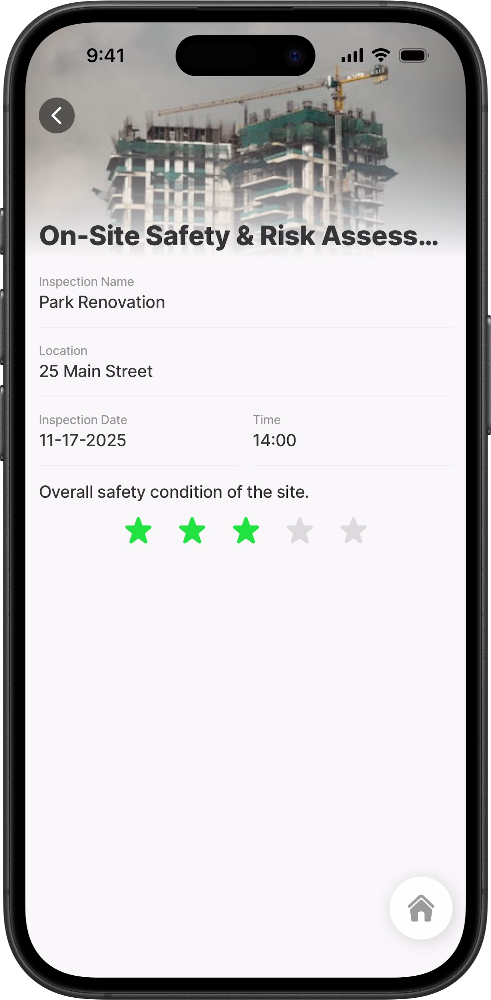
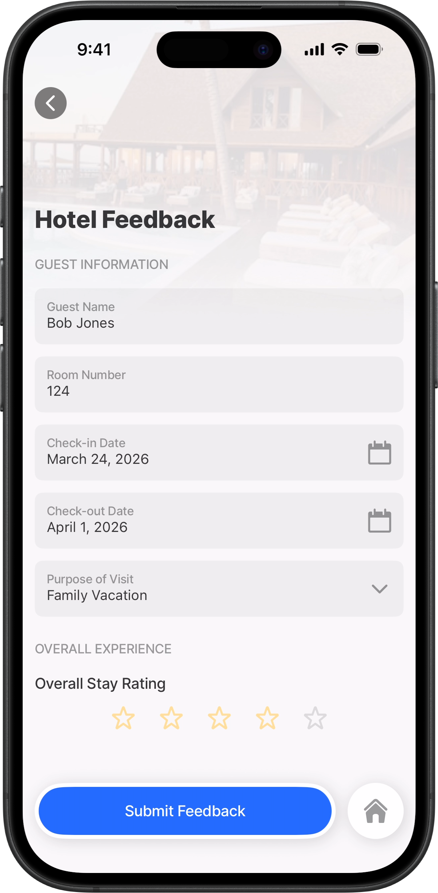
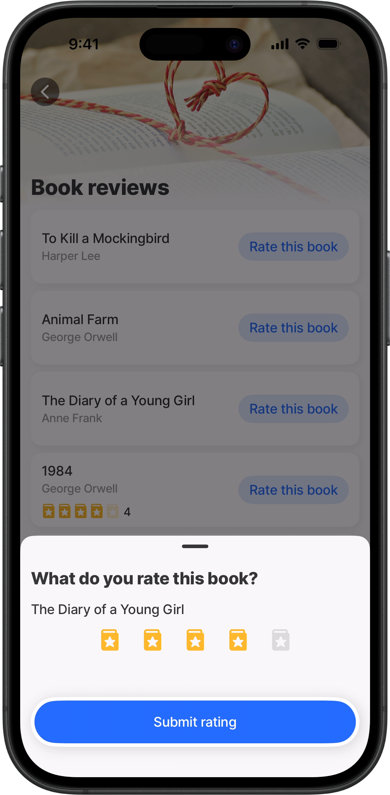
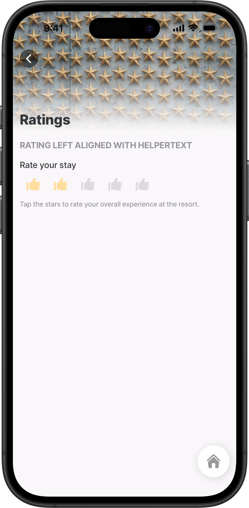
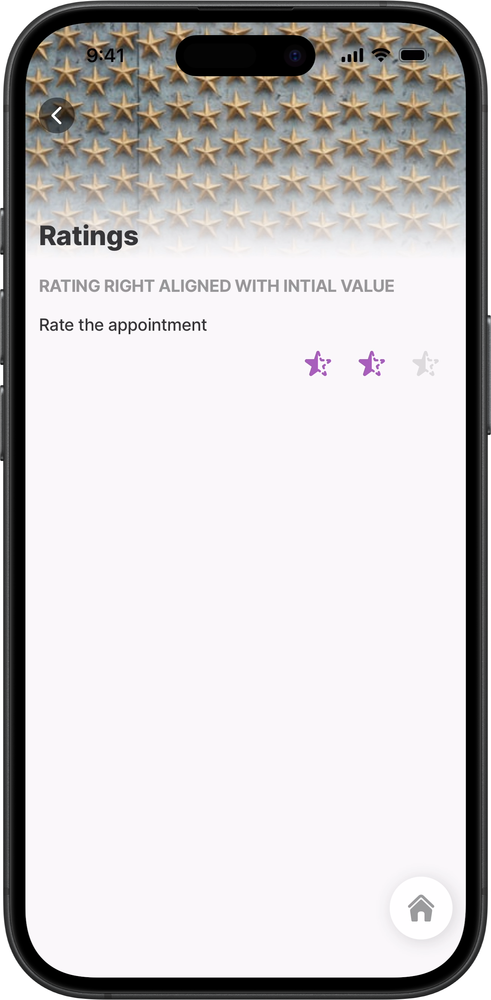
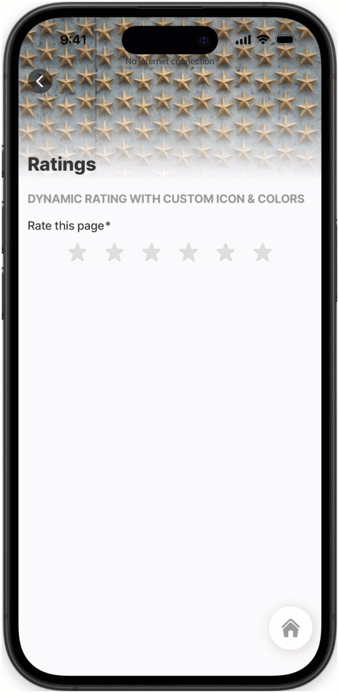
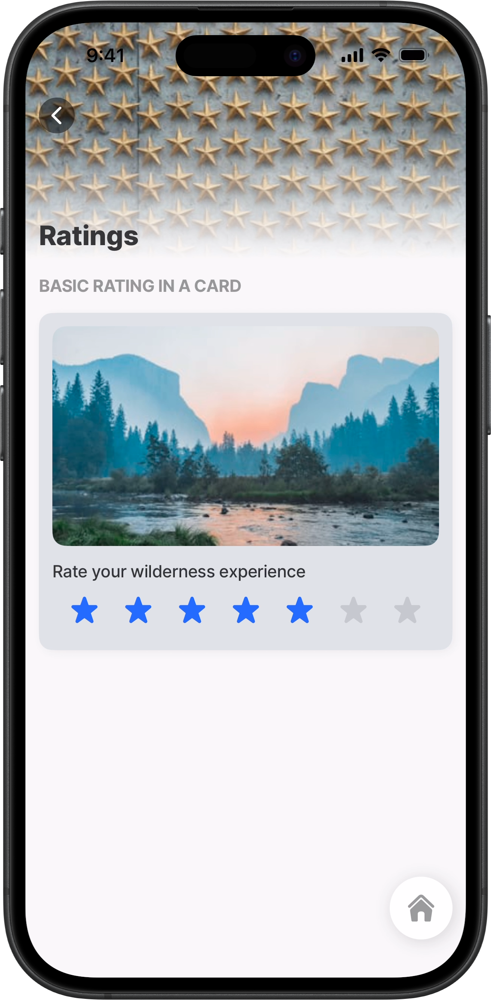

# rating



Use the `rating` component to capture a score rating by selecting a number of icons, such as a 5 star rating.

Typical use cases include product reviews, service feedback, and surveys.



<figure><figcaption><p>Rating component</p></figcaption></figure>



## Configuration options

Some properties are common to all components, see [Common component properties](<../../docs/Components/Common component properties.md>) for a list and their configuration options.

<table><thead><tr><th width="199.234375">Core structure</th><th>Description</th></tr></thead><tbody><tr><td><code>instanceId</code></td><td>The unique identifier for the rating component.</td></tr><tr><td><code>icon</code></td><td>The icon used for each rating step (for example, a star). If omitted, the default <code>rating-star</code> icon is used.</td></tr><tr><td><code>label</code></td><td>Provide a label/name for the rating input. Label is displayed as a placeholder when no value is provided.</td></tr><tr><td><code>maximum</code></td><td>The maximum rating value. This typically controls how many icons are shown, for example, 5.</td></tr></tbody></table>

<table><thead><tr><th width="197.9609375">Other options</th><th>Description</th></tr></thead><tbody><tr><td><code>align</code></td><td>The rating component's alignment within its container can be set to <code>left</code>, <code>center</code>, or <code>right</code>. The default is <code>center</code>. An expression can also be configured to set the alignment of the rating icons.</td></tr><tr><td><code>color</code></td><td>Sets the color of the rating's icons. Color conditions using the <code>when</code> property enable dynamic color options. First evaluated to be true will be used.</td></tr><tr><td><code>errorText</code></td><td>Add text, string, or expressions to show text under the rating indicating an error/invalid value in the field. ErrorText is shown in <code>isNegative</code> styling.</td></tr><tr><td><code>helperText</code></td><td>Add text, strings, or expressions to guide users by displaying text beneath the rating. HelperText is displayed only when there is no <code>errorText</code> property set.</td></tr><tr><td><code>initialValue</code></td><td>The value that the rating will load with when the screen initially loads. Use this to preset a default score.</td></tr><tr><td><code>isHidden</code></td><td>If <code>true</code> the rating will be hidden on the form. If set to <code>false</code> the field will be shown.</td></tr><tr><td><code>isIgnored</code></td><td>When <code>true</code>, the field will be ignored during data save, and the rating value will not be stored. This property is only applied when using the submit-form action.</td></tr><tr><td><code>isRequired</code></td><td>Set to <code>true</code> when the field is required, which is indicated by a grey asterisk. Set to <code>false</code>, the rating is optional.</td></tr><tr><td><code>style</code></td><td><p>The following property setting is available:</p><ul><li><code>isDisabled</code> - makes the rating field read-only.</li></ul></td></tr><tr><td><code>value</code></td><td>The value to show for the rating. This is typically a numeric value representing the selected score. The value to show in the rating when the form initially loads. This can be combined with the <code>isDisable</code> style to preset the value that cannot be changed.</td></tr></tbody></table>

<table><thead><tr><th width="203.73046875">Actions</th><th>Description</th></tr></thead><tbody><tr><td><code>onChange</code></td><td>The action is triggered when the value in the <code>rating</code> is changed. Use IntelliSense (ctrl+space) to see the list of available actions.</td></tr></tbody></table>

<table><thead><tr><th width="211.01953125">State Configuration</th><th width="143.390625">Key</th><th>Notes</th></tr></thead><tbody><tr><td><code>=@ctx.component.state.</code></td><td>value</td><td>State is the variable of the component.</td></tr></tbody></table>

## Considerations

* The component is available for use in a [jig.default](<../../docs/Jig Types/jig_default.md>), and in a [card](../../docs/Components/card.md), [section](section.md), [expander.md](../../docs/Components/expander/expander.md "mention"), and [view](<../../docs/Custom components _Alpha_/View _Alpha_.md>) components as children.
* If you want to _display_ a rating inside a list item (instead of capturing input), use the `rating` property on a [list-item](../../docs/Components/list/list-item.md).

## Examples and code snippets

### Basic rating



<figure><figcaption><p>Basic rating component</p></figcaption></figure>



Basic example to rate the safety of a building site using `component.rating` in a `default` jig. The rating value is stored in component state:\
`=@ctx.components.rating.state.value`





```yaml
title: On-Site Safety & Risk Assessment
type: jig.default

# Simple header with an image.
header:
  type: component.jig-header
  options:
    height: small
    children:
      type: component.image
      options:
        source:
          uri: https://images.unsplash.com/photo-1701844279504-e3a974aaafb5?w=400&auto=format&fit=crop&q=60&ixlib=rb-4.1.0&ixid=M3wxMjA3fDB8MHxzZWFyY2h8MTV8fGNvbnN0cnVjdGlvbnNpdGV8ZW58MHx8MHx8fDA%3D

children:
  # Use an entity to show contextual info above the rating.
  - type: component.entity
    options:
      children:
        - type: component.entity-field
          options:
            label: Inspection Name
            value: Park Renovation
        - type: component.entity-field
          options:
            label: Location
            value: 25 Main Street
        - type: component.field-row
          options:
            children:
              - type: component.entity-field
                options:
                  label: Inspection Date
                  value: 11-17-2025
              - type: component.entity-field
                options:
                  label: Time
                  value: 14:00

  # Rating input component.
  - type: component.rating
    instanceId: rating
    options:
      label: Overall safety condition of the site.
      # Icon controls the rating icon. The default icon is used.
      icon: rating-star
      # Maximum controls how many icons are shown.
      maximum: 5
      align: center
      # Color can be conditional using `when`.
      color:
        - when: =@ctx.component.state.value < 3
          color: negative
        - when: =@ctx.component.state.value >= 3
          color: positive

```



### Rating on a Form



In this example the rating component is used in a hotel feedback form to score guests overall experience. The `icon`, `color` and `maximum` number of icons are defined.&#x20;



<figure><figcaption><p>Rating on a form</p></figcaption></figure>





```yaml
yaml
# Hotel Feedback Form
# Purpose: Collect guest feedback after their stay at the hotel
# This form captures guest information, ratings, and overall experience
title: Hotel Feedback
type: jig.default

header:
  type: component.jig-header
  options:
    height: medium
    children:
      type: component.image
      options:
        source:
          uri: https://images.unsplash.com/photo-1566073771259-6a8506099945?w=400

children:
  - type: component.form
    instanceId: hotelFeedbackForm
    options:
      children:
        # Guest Information
        - type: component.section
          options:
            title: Guest Information
            children:
              - type: component.text-field
                instanceId: guestName
                options:
                  label: Guest Name
                  isRequired: true
              - type: component.text-field
                instanceId: roomNumber
                options:
                  label: Room Number
                  isRequired: true
              - type: component.date-picker
                instanceId: checkInDate
                options:
                  label: Check-in Date
                  isRequired: true
              - type: component.date-picker
                instanceId: checkOutDate
                options:
                  label: Check-out Date
                  isRequired: true
              - type: component.dropdown
                instanceId: visitPurpose
                options:
                  data: =@ctx.datasources.visit
                  label: Purpose of Visit
                  item:
                    type: component.dropdown-item
                    options:
                      title: =@ctx.current.item.title
                      value: =@ctx.current.item.title

        # Overall Experience. 5-star rating component for overall satisfaction.
        - type: component.section
          options:
            title: Overall Experience
            children:
              - type: component.rating
                instanceId: overallRating
                options:
                  label: Overall Stay Rating
                  # Customize the rating icon.
                  icon: rating-star-alternate
                  # Specify a color for the icons. The icon color shows
                  # when the icon is tapped.
                  color: color3
                  isRequired: true
                  # Specify the number of icons to display.
                  maximum: 5
# ============================================
# FORM SUBMISSION ACTIONS
# Sequential actions executed when form is submitted
# ============================================
actions:
  - children:
      - type: action.action-list
        options:
          title: Submit Feedback
          isSequential: true
          actions:
             # Action 1: Submit form data to local storage.
            - type: action.submit-form
              options:
                formId: hotelFeedbackForm
                provider: DATA_PROVIDER_LOCAL
                entity: hotel-feedback
                method: create
            # Action 2: Show success message to user.    
            - type: action.show-alert
              options:
                title: Thank You!
                presentAs: modal
                icon: check-circle
                subtitle: Your feedback has been submitted successfully.
                style:
                  isPositive: true
```



```yaml
datasources:
  visit:
    type: datasource.static
    options:
      data:
        - id: 1
          title: Business
        - id: 2
          title: Leisure
        - id: 3
          title: Family Vacation
        - id: 4
          title: Romantic Getaway
        - id: 5
          title: Other
```



### Rating with custom icon & colors



<figure><figcaption><p>Rating with icons &#x26; color</p></figcaption></figure>



In this example, books are reviewed by selecting a book from the list. Selecting a book opens a modal containing a rating component configured with a custom icon, color, and number of icons. An input is used to pass the book title to the modal and display it as the title of the rating component.

When a rating is submitted, the selected value is saved to the corresponding book record in the database. The BookId is passed to the modal as an input and used by the action to identify which book record to update. Once the modal closes, the saved rating value is retrieved from the database and displayed using the list-item’s rating property.


Note: This example highlights the difference between the rating component, which captures a rating, and the list-item’s rating property, which is used only to display a rating on a list item.






<pre class="language-yaml"><code class="lang-yaml"># Book Reviews 
# Purpose: Display a list of books with ratings and allow users to rate each book
# Shows book cover, title, author, current rating, and provides access to rating 
# form as a modal.
title: Book reviews
type: jig.default

header:
  type: component.jig-header
  options:
    height: small
    children:
      type: component.image
      options:
        source:
          uri: https://cdn.pixabay.com/photo/2016/10/22/15/19/book-1760998_1280.jpg
# ============================================
# MAIN CONTENT: Scrollable list of books
# ============================================
children:
  - type: component.list
    options:
     # Data source binding - pulls from books datasource.
      data: =@ctx.datasources.books
      maximumItemsToRender: 8
      item:  
      # LIST ITEM- Defines how each book appears in the list.
        type: component.list-item
        options:
          title: =@ctx.current.item.title
          subtitle: =@ctx.current.item.author
          # List rating property used to display the rating value from the datasource.
          # NOTE: This is not the rating component itself. It displays the value
<strong>          # selected in the rating component in the Book Rating jig and saved to the database
</strong>          rating:
            value: =@ctx.current.item.rating
            ratingIcon:
              icon: book-star
              color: warning
              maximum: 5
          isContained: true
          # Book cover image.
          leftElement:
            element: image
            text: ""
            uri: =@ctx.current.item.image
            resizeMode: center
            size: regular
            shape: square
          # RIGHT ELEMENT: Rate button. Opens rating modal when pressed.  
          rightElement:
            element: button
            title: Rate this book
            onPress:
              type: action.go-to
              options:
                # Navigate to book-rating jig.
                linkTo: book-rating
                # Open as modal overlay (doesn't leave current screen).
                isModal: true
                inputs:
                  # Send book title to display in rating form.
                  book-title: =@ctx.current.item.title
                  # Send book ID to associate rating with correct book.
                  bookId: =@ctx.current.item.id

</code></pre>



```yaml
# Book Rating Jig
# Purpose: Modal screen for users to rate a specific book.
# Receives book details as inputs and saves the rating back to the datasource.
title: What do you rate this book?
type: jig.default
# Data passed from the book list when opening this modal.
inputs:
  # Unique identifier for the book being rated.
  bookId:
    type: string
    required: true
  # Book title to display in the rating label.  
  book-title:
    type: string
    required: true
# ============================================
# RATING COMPONENT
# Single interactive star rating input
# ============================================
children:
  - type: component.rating
    # Instance ID for referencing rating value in actions.
    instanceId: rating
    options:
      # Dynamic label showing the book title from inputs.
      label: =@ctx.jig.inputs.book-title
      # Book-themed star icon.
      icon: book-star
      color: warning
      # 5-star rating scale
      maximum: 5
# Sequential actions to save rating and close modal.      
actions:
  - numberOfVisibleActions: 1
    children:
      - type: action.action-list
        options:
          title: Submit rating
          isSequential: true
          actions:
            # Action 1: Save rating to database.
            # Updates the book record with new rating value.
            - type: action.execute-entity
              options:
                provider: DATA_PROVIDER_DYNAMIC
                entity: default/book-review
                # Update existing record (not create new).
                method: update
                # Data to send in update request.
                data:
                  # Book ID converted to string format.
                  id: =$string(@ctx.jig.inputs.bookId)
                  # User's rating value from the rating component.
                  rating: =@ctx.components.rating.state.value
            # Action 2: Close modal and return to book list.
            # Automatically refreshes list to show updated rating.      
            - type: action.go-back
```



```yaml
datasources:
  books:
    type: datasource.sqlite
    options:
      provider: DATA_PROVIDER_DYNAMIC
      entities:
        - default/book-review
      query: SELECT
        id,
        '$.title',
        '$.author',
        '$.image',
        '$.rating'
        FROM [default/book-review]
```



### Rating left aligned with helperText



In this example, the rating component is configured with custom `icons` that are left-`aligned`, along with a custom `color`, `title`, and `helperText` displayed beneath the icons.



<figure><figcaption><p>Rating with helperText</p></figcaption></figure>





```yaml
title: Ratings
type: jig.default

header:
  type: component.jig-header
  options:
    height: small
    children:
      type: component.image
      options:
        source:
          uri: https://images.unsplash.com/photo-1585853565090-5227d79f2171?w=400&auto=format&fit=crop&q=60&ixlib=rb-4.1.0&ixid=M3wxMjA3fDB8MHxzZWFyY2h8M3x8cmF0aW5nfGVufDB8fDB8fHww
# Resets the rating component to clear any previous selection when the screen is
# refreshed or comes into focus.
onFocus:
  type: action.reset-state
  options:
    state: =@ctx.components.rating-align.state.value
onRefresh:
  type: action.reset-state
  options:
    state: =@ctx.components.rating-align.state.value
# Rating component contained in a section component.
children:
    - type: component.section
    options:
      title:
        text: Rating left aligned with helperText
        fontSize: regular
        isBold: true
        numberOfLines: 1
        transform: uppercase
      children:
        - type: component.rating
          # Instance ID for referencing in actions and state management.
          instanceId: rating-align
          options:
            # Label displayed above the rating stars.
            label: Rate your stay
            # Thumbs-up icon instead of default stars.
            icon: thumb-up-like
            color: color3
            # Left-align the rating component (default is center).
            align: left
            # Maximum rating value (5 thumbs-up icons).
            maximum: 5
            # Helper text providing guidance to users
            helperText: Tap the stars to rate your overall experience at the resort.
```



### Rating right aligned with initial value



<figure><figcaption><p>Rating with initial value</p></figcaption></figure>



In this example, the rating component is configured with custom right-`aligned` `icons`, a custom `color` and `title`, and an `initialValue` that is set when the screen opens. The rating can be updated by tapping the icons.





```yaml
title: Ratings
type: jig.default

header:
  type: component.jig-header
  options:
    height: small
    children:
      type: component.image
      options:
        source:
          uri: https://images.unsplash.com/photo-1585853565090-5227d79f2171?w=400&auto=format&fit=crop&q=60&ixlib=rb-4.1.0&ixid=M3wxMjA3fDB8MHxzZWFyY2h8M3x8cmF0aW5nfGVufDB8fDB8fHww
# Resets the rating component's state to the initial value configured when the
# screen is refreshed or comes into focus.
onFocus:
  type: action.reset-state
  options:
    state: =@ctx.components.rating-event.state.value
onRefresh:   
  type: action.reset-state
  options:
    state: =@ctx.components.rating-event.state.value
# Rating component contained in a section component.   
children:
  - type: component.section
    options:
      title:
        text: Rating right aligned with intial value
        fontSize: regular
        isBold: true
        numberOfLines: 1
        transform: uppercase
      children:
        - type: component.rating
          # Instance ID for referencing in actions and state management.
          instanceId: rating-event
          options:
           # Label displayed above the rating icon.
            label: Rate the appointment
            icon: star-half
            color: color11
            # Preset rating value to display (two icons are selected)
            initialValue: 2
            # Right-align the rating component (default is center).
            align: right
            # Maximum rating value
            maximum: 3

```



### Dynamic rating with conditional icons & colors



This example demonstrates an advanced rating component that dynamically changes its appearance based on user interaction. Expressions are used in the `icon` and `color` properties to conditionally apply different icons and colors based on the number of icons selected by the user.

1. When the component loads, no rating is selected
2. As the user taps icons to select a rating (1-6):
   * The `@ctx.component.state.value` updates immediately.
   * The `icon` expression evaluates and switches between happy/confused emojis.
   * The `color` conditions evaluate and apply the appropriate theme color
3. The user sees real-time visual feedback showing:
   * Low ratings (1-2): Red confused emoji
   * Medium rating (3): Yellow/orange confused emoji
   * High ratings (4-6): Green happy emoji



<figure><figcaption><p>Rating icon &#x26; color set dynamically</p></figcaption></figure>





```yaml
title: Ratings
type: jig.default

header:
  type: component.jig-header
  options:
    height: small
    children:
      type: component.image
      options:
        source:
          uri: https://images.unsplash.com/photo-1585853565090-5227d79f2171?w=400&auto=format&fit=crop&q=60&ixlib=rb-4.1.0&ixid=M3wxMjA3fDB8MHxzZWFyY2h8M3x8cmF0aW5nfGVufDB8fDB8fHww
# Resets the rating component to clear any previous selection.
# Triggered when user navigates or refreshes the jig. 
onFocus:
  type: action.reset-state
  options:
    state: =@ctx.components.rating-icon.state.value
onRefresh:
  type: action.reset-state
    options:
      state: =@ctx.components.rating-icon.state.value
      
children:
  - type: component.rating
     # Instance ID for referencing this component in actions and expressions.
    instanceId: rating-icon
    options:
      # Label displayed above the rating icons.
      label: Rate this page
      # Uses ternary operator to switch between icons based on rating value.
      # Expression evaluates in real-time as user selects rating.
      # Rating 4-6 = emoji-great, Rating 1-3 = emoji-confuse-1.
      icon: =@ctx.component.state.value > 3 ? 'emoji-great' :'emoji-confuse-1'
      # Array of conditions to apply different colors based on rating.
      # Evaluated top-to-bottom; first condition that evaluates to true is used.
      color:
        - when: =@ctx.component.state.value > 3
          color: positive
        - when: =@ctx.component.state.value < 3
          color: negative
        - when: =@ctx.component.state.value = 3
          color: warning
      # Maximum rating value - creates a 6-point rating scale.    
      maximum: 6
```



### Rating in a card



<figure><figcaption><p>Rating in a card component</p></figcaption></figure>



In this example, a wilderness experience is scored using the rating component, which is configured inside a `card` component with custom `icons` and a `title`.





```yaml
title: Ratings
type: jig.default

header:
  type: component.jig-header
  options:
    height: tiny
# Resets the rating component's state to clear the selection when the
# screen is refreshed or comes into focus.    
onFocus:
  type: action.reset-state
  options:
    state: =@ctx.components.rating-rating.state.value
onRefresh:
  type: action.reset-state
  options:
    state: =@ctx.components.rating-rating.state.value
# Rating component contained in a card component.       
children:
  - type: component.card
    options:
      # Card background color.
      color: color14
      children:
        # Image displayed in the card.
        - type: component.image
          options:
            source:
              uri: https://images.unsplash.com/photo-1506744038136-46273834b3fb?w=400&auto=format&fit=crop&q=60&ixlib=rb-4.1.0&ixid=M3wxMjA3fDB8MHxzZWFyY2h8Mnx8cmF0aW5nfGVufDB8fDB8fHww
        # Rating component in the card.
        - type: component.rating
          # Instance ID for referencing in actions and state management.
          instanceId: rating
          options:
            # Label displayed above the rating stars.
            label: Rate your wilderness experience
            # Default alignment of icons.
            align: center
            # Default icons.
            icon: rating-star
            # Maximum rating value
            maximum: 7
```


