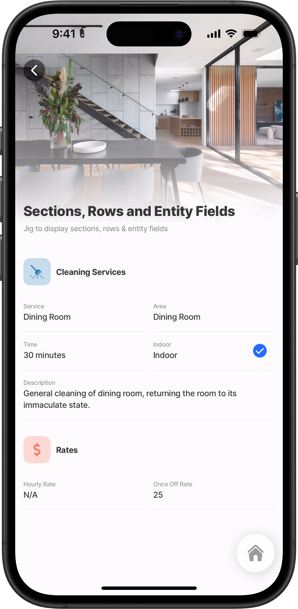
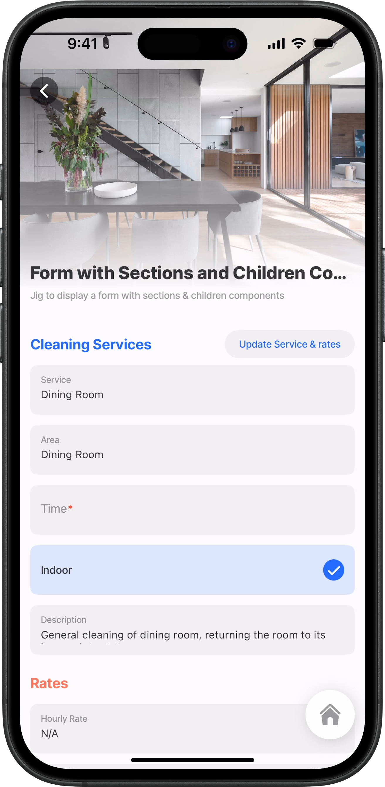
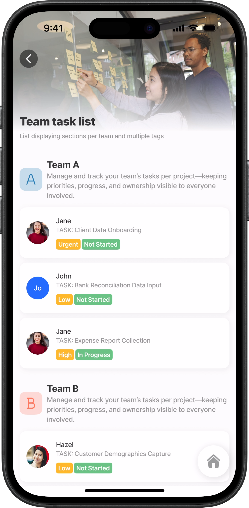
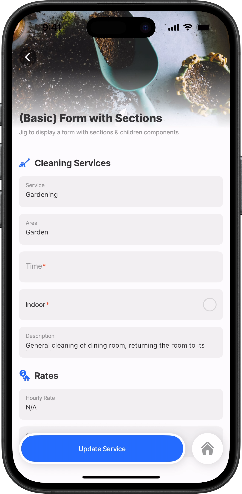
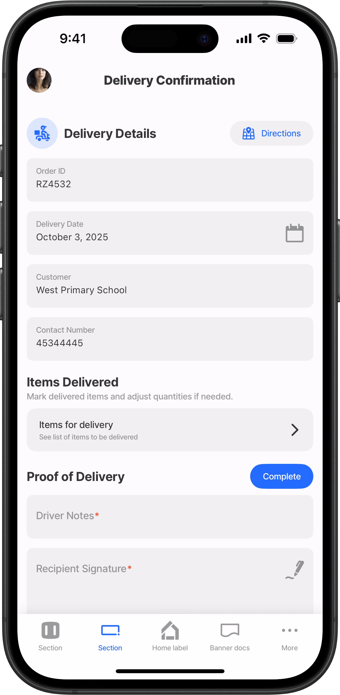

# section

The section component groups related items together under a single title. A section can be set up on a [jig.default](<../../docs/Jig Types/jig_default.md>) under the [entity](../../docs/Components/entity/entity.md) component or on a [form](../../docs/Components/form/form.md) component as its container. The component can contain [field-row](https://docs.jigx.com/examples/readme/components/entity/field-row) and [entity-field](../../docs/Components/entity/entity-field.md) components or children components on a [form](../../docs/Components/form/form.md) component.

A `component.section` can be set up with the following combinations:

1. An entity containing sections with [rows](../../docs/Components/entity/field-row.md) and [entity-field](../../docs/Components/entity/entity-field.md) for display purposes.
2. An entity containing sections and [entity-field](../../docs/Components/entity/entity-field.md) for display purposes.
3. A form component containing sections with [rows](../../docs/Components/entity/field-row.md) and children for display/capturing purposes.
4. A form component containing sections and children components for display/capturing purposes.
5. Horizontal lists cannot be used with the [section](https://docs.jigx.com/examples/section) components as an empty white jig will be displayed.

## Configuration options

Some properties are common to all components, see [Common component properties](https://docs.jigx.com/examples/readme/components/avatar-field) for a list and their configuration options.

<table><thead><tr><th width="141">Core structure</th><th></th></tr></thead><tbody><tr><td><code>title</code></td><td><p>The <code>title</code> property defines the main text displayed in the section. It supports multiple configuration options; you can provide a static string, bind it dynamically using an expression, or extend it with advanced styling and formatting. </p><p>You can control text appearance using properties such as <code>fontSize</code>, <code>isbold</code>, and <code>color</code>, <a data-footnote-ref href="#user-content-fn-1"><code>transform</code></a>, as well as specify the <code>numberOfLines</code> to display. </p></td></tr><tr><td><code>children</code></td><td>Add <a href="../../docs/components/">components</a> that are grouped inside the section, such as number, text, and email fields. Text that can be evaluated, translated, and formatted</td></tr></tbody></table>

<table><thead><tr><th width="140.61328125">Other options</th><th></th></tr></thead><tbody><tr><td><code>icon</code></td><td>Icon to be displayed on the left side of the header. The <code>icon</code> displays on the left side of the section, providing a visual cue. The icon can be fully customized using styling options such as <code>type</code> (duotone, contained, or basic), <code>shape</code> (rounded, circle, or basic), and <code>color</code> to align with your app’s design. </td></tr><tr><td><code>subtitle</code></td><td><p>The <code>subtitle</code> property defines the secondary text displayed beneath the section’s <code>title</code>.  It supports multiple configuration options; you can provide a static string, bind it dynamically using an expression, or extend it with advanced styling and formatting. </p><p>You can control text appearance using properties such as <code>fontSize</code>, <code>isbold</code>, and <code>color</code>, <code>transform</code>, as well as specify the <code>numberOfLines</code> to display. </p></td></tr></tbody></table>

<table><thead><tr><th width="135.9296875">Actions</th><th></th></tr></thead><tbody><tr><td><code>actions</code></td><td>The <code>action</code> property defines what happens when the section’s action button is tapped. You can configure it to trigger any supported app <a href="../../docs/Actions/">action</a>, such as navigating to another screen, opening a URL/map, or updating data. Use IntelliSense to explore the full list of available actions.  </td></tr></tbody></table>

<table><thead><tr><th width="317.00390625">State</th><th width="104.6796875"></th><th></th></tr></thead><tbody><tr><td>=@ctx.solution.state.</td><td>status</td><td>Global state variable that can be used throughout the solution.</td></tr><tr><td>=@ctx.jigs.state.</td><td>filter<br>searchtext</td><td>Jig-level state that applies to the specific jig (screen) context, with available keys depending on the jig type (e.g., for list jigs: activeItem, filter, searchText, etc.)</td></tr><tr><td><p></p><p>=@ctx.jig.components.instanceId.state.</p></td><td>value</td><td> State variable of a specific component in the jig.</td></tr></tbody></table>



## Considerations

* When no `title` formatting or styling is applied, section titles default to `transform: UPPERCASE`  with `isSubtle: true`.
* You can determine the `fontSize` by configuring an expression.

## Examples and code snippets

### Sections with icons, text styling, rows, and entity fields&#x20;



<figure><figcaption><p>Jig with sections, icons and text styling</p></figcaption></figure>



Using sections, rows, and entity fields, along with `icons` and `text` styling, to create relevant display sections for information that is functional, elegant, and neatly organized. (Display only)

**Examples:**  See the full example using dynamic data in [GitHub](https://github.com/jigx-com/jigx-samples/blob/main/quickstart/jigx-samples/jigs/jigx-components/section/dynamic-data/section-row-entity-field-dd.jigx).





```yaml
title: Sections, Rows and Entity Fields
type: jig.default
description: Jig to display sections with icons, text styling, rows & entity fields

header:
  type: component.jig-header
  options:
    height: medium
    children:
      type: component.image
      options:
        source:
          uri: =@ctx.datasources.cleaning-services-dynamic[0].image
          
children:
  - type: component.entity
    options:
      children:
         # Section added for services.
        - type: component.section
          options:
           # Section header text with font and boldness defined.
            title:
              text: Cleaning Services
              fontSize: regular
              isBold: true
            # Section header icon with styling defined.
            icon:
              name: cleaning-broom
              color: color1
              shape: rounded
              type: contained
            children:
              - type: component.field-row
                options:
                  children:
                    - type: component.entity-field
                      options:
                        label: Service
                        value: =@ctx.datasources.cleaning-services-dynamic[0].service
                    - type: component.entity-field
                      options:
                        label: Area
                        value: =@ctx.datasources.cleaning-services-dynamic[0].area
              - type: component.field-row
                options:
                  children:
                    - type: component.entity-field
                      options:
                        label: Time
                        value: =@ctx.datasources.cleaning-services-dynamic[0].time & ' minutes'
                    - type: component.entity-field
                      options:
                        contentType: checkbox
                        label: Indoor
                        value: =@ctx.datasources.cleaning-services-dynamic[0].indoor
              - type: component.field-row
                options:
                  children:
                    - type: component.entity-field
                      options:
                        isMultiline: true
                        label: Description
                        value: =@ctx.datasources.cleaning-services-dynamic[0].description
        # Section added for rates.              
        - type: component.section
          options:
          # Section header text with font and boldness defined.
            title:
              text: Rates
              fontSize: regular
              isBold: true
            # Section icon with styling defined.  
            icon:
              name: currency-dollar
              color: color4
              shape: rounded
              type: contained
            children:
              - type: component.field-row
                options:
                  children:
                    - type: component.entity-field
                      options:
                        label: Hourly Rate
                        value:
                          =@ctx.datasources.cleaning-services-dynamic[0].hourlyrate != null ?
                          @ctx.datasources.cleaning-services-dynamic[0].hourlyrate:'N/A'   
                    - type: component.entity-field
                      options:
                        label: Once Off Rate
                        value:
                          =@ctx.datasources.cleaning-services-dynamic[0].onceoffrate != null ?
                          @ctx.datasources.cleaning-services-dynamic[0].onceoffrate:'N/A'
```



```yaml
datasources:
  cleaning-services-dynamic:
    type: datasource.sqlite
    options:
      provider: DATA_PROVIDER_DYNAMIC
      entities:
        - entity: default/cleaning-services
      query: |
        SELECT 
          id, 
          '$.area', 
          '$.description', 
          '$.hourlyrate', 
          '$.illustration', 
          '$.image', 
          '$.indoor', 
          '$.onceoffrate', 
          '$.service', 
          '$.time' 
        FROM [default/cleaning-services]
```



### Sections with text styling, rows, and children components (Display and input)



<figure><figcaption><p>Jig with sections text styling and actions</p></figcaption></figure>



Similar to the above example, this has the same functionality, except that this is for adding or editing data too, and not just for display purposes. The `execute-entity` action is added to the section header.

**Examples:** See the full example using dynamic data in [GitHub](https://github.com/jigx-com/jigx-samples/blob/main/quickstart/jigx-samples/jigs/jigx-components/section/dynamic-data/form-section-row-children-dd.jigx).

**Datasource:** See the full datasource for dynamic data in [GitHub](https://github.com/jigx-com/jigx-samples/blob/main/quickstart/jigx-samples/datasources/services/cleaning-services-dynamic.jigx).    &#x20;





```yaml
title: Form with Sections and Children Components
description: Jig to display a form with sections & children components
type: jig.default

header:
  type: component.jig-header
  options:
    height: medium
    children:
      type: component.image
      options:
        source:
          uri: =@ctx.datasources.cleaning-services-dynamic[0].image

children:
  - type: component.form
    options:
      children:
        # Section added for services.
        - type: component.section
          options:
            # Section header text with font, color and boldness defined.
            title:
              text: Cleaning Services
              fontSize: medium
              color: color1
              isBold: true
            # Section header action to update the Dynamic Data.  
            actions:
              - type: action.execute-entity
                options:
                  title: Update Service & rates
                  provider: DATA_PROVIDER_DYNAMIC
                  entity: default/cleaning-services
                  method: update
                  data:
                    id: sectionId
                    service: =@ctx.components.cleaning_serv_tf.state.value
                    area: =@ctx.components.cleaning_serv_area_tf.state.value
                    time: =@ctx.components.cleaning_serv_time_num.state.value
                    indoor: =@ctx.components.cleaning_serv_indoor_checkbox.state.value
                    description: =@ctx.components.cleaning_serv_desc_tf.state.value
                    hourlyRate: =@ctx.components.cleaning_serv_hourly_tf.state.value
                    onceOffRate: =@ctx.components.cleaning_serv_once_tf.state.value  
            children:
              - type: component.text-field
                instanceId: cleaning_serv_tf
                options:
                  label: Service
                  value: =@ctx.datasources.cleaning-services-dynamic[0].service
              - type: component.text-field
                instanceId: cleaning_serv_area_tf
                options:
                  label: Area
                  value: =@ctx.datasources.cleaning-services-dynamic[0].area
              - type: component.number-field
                instanceId: cleaning_serv_time_num
                options:
                  label: Time
                  value: =@ctx.datasources.cleaning-services-dynamic[0].time & ' minutes'
                  keyboardType: number-pad
              - type: component.checkbox
                instanceId: cleaning_serv_indoor_checkbox
                options:
                  label: Indoor
                  value: =@ctx.datasources.cleaning-services-dynamic[0].indoor
              - type: component.text-field
                instanceId: cleaning_serv_desc_tf
                options:
                  label: Description
                  value: =@ctx.datasources.cleaning-services-dynamic[0].description
                  isMultiline: true
        # Section added for rates.           
        - type: component.section
          options:
            # Section header text with font, color and boldness defined.
            title:
              text: Rates
              fontSize: medium
              color: color4
              isBold: true
            children:
              - type: component.text-field
                instanceId: cleaning_serv_hourly_tf
                options:
                  label: Hourly Rate
                  value: =@ctx.datasources.cleaning-services-dynamic[0].hourlyrate != null ? @ctx.datasources.cleaning-services-dynamic[0].hourlyrate:'N/A'
              - type: component.text-field
                instanceId: cleaning_serv_once_tf
                options:
                  label: Once Off Rate
                  value: =@ctx.datasources.cleaning-services-dynamic[0].onceoffrate != null ? @ctx.datasources.cleaning-services-dynamic[0].onceoffrate :'N/A'

```



```yaml
datasources:
  cleaning-services-dynamic:
    type: datasource.sqlite
    options:
      provider: DATA_PROVIDER_DYNAMIC
      entities:
        - entity: default/cleaning-services
      query: |
        SELECT 
          id, 
          '$.area', 
          '$.description', 
          '$.hourlyrate', 
          '$.illustration', 
          '$.image', 
          '$.indoor', 
          '$.onceoffrate', 
          '$.service', 
          '$.time', 
          '$.category' 
        FROM [default/cleaning-services]
```



### Sections with icons & multi-lined subtitle



<figure><figcaption><p>Sections with icons, multi-line subtitle, list children</p></figcaption></figure>



This example demonstrates how to use `sections` with styled `icons`, formatted `titles`, and multi-line `subtitles` to create a clear and visually engaging layout. Each section represents a project team, displaying their key details and task summaries in an organized structure.

**Examples:**\
See the full example in [GitHub](https://github.com/jigx-com/jigx-samples/blob/main/quickstart/jigx-samples/jigs/jigx-components/section/dynamic-data/section-icon-subtitle.jigx).





```yaml
title: Team task list
description: List displaying sections per team and multiple tags
type: jig.default

header:
  type: component.jig-header
  options:
    height: small
    children:
      options:
        source:
          uri: https://images.unsplash.com/photo-1590402494628-9b9acf0b90ae?q=80&w=2970&auto=format&fit=crop&ixlib=rb-4.0.3&ixid=M3wxMjA3fDB8MHxwaG90by1wYWdlfHx8fGVufDB8fHx8fA%3D%3D
      type: component.image

children:
 # Section added for team A.  
  - type: component.section
    options:
     # Section header title text with font and boldness defined.
      title:
        text: Team A
        fontSize: medium
        isBold: true
      # Section header styled icon. 
      icon:
        name: text-format-capital-formatting
        color: color1
        shape: rounded
        type: contained
      # Section header with subtle subtitle multi-lined text.  
      subtitle:
        text: Manage and track your team’s tasks per project—keeping priorities, progress, and ownership visible to everyone involved.
        fontSize: regular
        isSubtle: true
        isBold: false
        numberOfLines: 3
      children:
        - type: component.list
          options:
            data: =@ctx.datasources.team-tasks[team='teamA' and taskStatus!='Complete']
            maximumItemsToRender: 8
            item:
              type: component.list-item
              options:
                isContained: true
                title: =@ctx.current.item.taskAssignee
                subtitle: =@ctx.current.item.taskName
                tags:
                  - text: =@ctx.current.item.priority
                    color: warning
                  - text: =@ctx.current.item.taskStatus
                    color: color2
                leftElement:
                  element: avatar
                  text: =@ctx.current.item.taskAssignee
                  uri: =@ctx.current.item.Profile
  # Section added for team B.
  - type: component.section
    options:
     # Section header title text with font and boldness defined.
      title:
        text: Team B
        fontSize: medium
        isBold: true
      # Section header styled icon.   
      icon:
        name: text-bold-formatting
        color: color4
        shape: rounded
        type: contained
      # Section header with subtle subtitle multi-lined text.   
      subtitle:
        text: Manage and track your team’s tasks per project—keeping priorities, progress, and ownership visible to everyone involved.
        fontSize: regular
        isSubtle: true
        isBold: false
        numberOfLines: 3
      children:
        - type: component.list
          options:
            data: =@ctx.datasources.team-tasks[team ='teamB' and taskStatus!='Complete']
            maximumItemsToRender: 8
            item:
              type: component.list-item
              options:
                isContained: true
                title: =@ctx.current.item.taskAssignee
                subtitle: =@ctx.current.item.taskName
                tags:
                  - text: =@ctx.current.item.priority
                    color: warning
                  - text: =@ctx.current.item.taskStatus
                    color: color2
                leftElement:
                  element: avatar
                  text: =@ctx.current.item.taskAssignee
                  uri: =@ctx.current.item.Profile
  # Section added for team C.                
  - type: component.section
    options:
      # Section header title text with font and boldness defined.
      title:
        text: Team C
        fontSize: medium
        isBold: true
      # Section header styled icon.   
      icon:
        name: calcium
        color: color8
        shape: rounded
        type: contained
      # Section header with subtle subtitle multi-lined text.   
      subtitle:
        text: Manage and track your team’s tasks per project—keeping priorities, progress, and ownership visible to everyone involved.
        fontSize: regular
        isSubtle: true
        isBold: false
        numberOfLines: 3
      children:
        - type: component.list
          options:
            data: =@ctx.datasources.team-tasks[team ='teamC' and taskStatus!='Complete']
            maximumItemsToRender: 8
            item:
              type: component.list-item
              options:
                isContained: true
                title: =@ctx.current.item.taskAssignee
                subtitle: =@ctx.current.item.taskName
                tags:
                  - text: =@ctx.current.item.priority
                    color: warning
                  - text: =@ctx.current.item.taskStatus
                    color: color2
                leftElement:
                  element: avatar
                  text: =@ctx.current.item.taskAssignee
                  uri: =@ctx.current.item.Profile

```



```yaml
datasources:
  team-tasks:
    type: datasource.sqlite
    options:
      provider: DATA_PROVIDER_DYNAMIC
      entities:
        - entity: default/tasks
      query: |
        SELECT 
          id, 
          '$.taskAssignee',
          '$.taskName',
          '$.taskCost',
          '$.taskId', 
          '$.taskStatus',
          '$.team', 
          '$.Profile',
          '$.priority'
        FROM [default/tasks]
```



### Basic form with sections (Display and input)



<figure><figcaption><p>Basic form with sections</p></figcaption></figure>



Using sections, along with `icons` and `text` styling, creates relevant display sections for information that is functional, elegant, and neatly organized. (Display and input)

**Examples:** See the full example using dynamic data in [GitHub](https://github.com/jigx-com/jigx-samples/blob/main/quickstart/jigx-samples/jigs/jigx-components/section/dynamic-data/form-section-children-dd.jigx).

**Datasources:** See the full datasource for dynamic data in [GitHub](https://github.com/jigx-com/jigx-samples/blob/main/quickstart/jigx-samples/jigs/jigx-components/section/dynamic-data/form-section-children-dd.jigx).





```yaml
title: (Basic) Form with Sections
description: Jig to display a form with sections & children components
type: jig.default

header:
  type: component.jig-header
  options:
    height: small
    children:
      type: component.image
      options:
        source:
          uri: =@ctx.datasources.cleaning-services-dynamic[1].image

actions:
  - children:
      - type: action.execute-entity
        options:
          title: Update Service
          provider: DATA_PROVIDER_DYNAMIC
          entity: default/cleaning-services
          method: update
          data:
            id: sectionId
            service: =@ctx.components.cleaning_serv_tf.state.value
            area: =@ctx.components.cleaning_serv_area_tf.state.value
            time: =@ctx.components.cleaning_serv_time_num.state.value
            indoor: =@ctx.components.cleaning_serv_indoor_checkbox.state.value
            description: =@ctx.components.cleaning_serv_desc_tf.state.value
            hourlyRate: =@ctx.components.cleaning_serv_hourly_tf.state.value
            onceOffRate: =@ctx.components.cleaning_serv_once_tf.state.value

children:
  - type: component.form
    options:
      children:
        - type: component.section
          options:
            title:
              text: Cleaning Services
              fontSize: medium
              isBold: true
            icon:
              name: gardening-lawn-mower-1-farming
              shape: basic
              type: basic
            children:
              - type: component.text-field
                instanceId: cleaning_serv_tf
                options:
                  label: Service
                  value: =@ctx.datasources.cleaning-services-dynamic[1].service
              - type: component.text-field
                instanceId: cleaning_serv_area_tf
                options:
                  label: Area
                  value: =@ctx.datasources.cleaning-services-dynamic[1].area
              - type: component.number-field
                instanceId: cleaning_serv_time_num
                options:
                  label: Time
                  value: =@ctx.datasources.cleaning-services-dynamic[1].time & ' minutes'
                  keyboardType: number-pad
              - type: component.checkbox
                instanceId: cleaning_serv_indoor_checkbox
                options:
                  label: Indoor
                  value: =@ctx.datasources.cleaning-services-dynamic[1].indoor
              - type: component.text-field
                instanceId: cleaning_serv_desc_tf
                options:
                  label: Description
                  value: =@ctx.datasources.cleaning-services-dynamic[1].description
                  isMultiline: true
        - type: component.section
          options:
            title:
              text: Rates
              fontSize: medium
              isBold: true
            icon:
              name: cost-of-living-money-chat-real-estate
              shape: basic
              type: basic
            children:
              - type: component.text-field
                instanceId: cleaning_serv_hourly_tf
                options:
                  label: Hourly Rate
                  value: =@ctx.datasources.cleaning-services-dynamic[1].hourlyrate != null ? @ctx.datasources.cleaning-services-dynamic[1].hourlyrate:'N/A'
              - type: component.text-field
                instanceId: cleaning_serv_once_tf
                options:
                  label: Once Off Rate
                  value: =@ctx.datasources.cleaning-services-dynamic[1].onceoffrate != null ? @ctx.datasources.cleaning-services-dynamic[1].onceoffrate :'N/A'

```



```yaml
datasources:
  cleaning-services-dynamic:
    type: datasource.sqlite
    options:
      provider: DATA_PROVIDER_DYNAMIC

      entities:
        - entity: default/cleaning-services

      query: |
        SELECT 
          id, 
          '$.area', 
          '$.description', 
          '$.hourlyrate', 
          '$.illustration', 
          '$.image', 
          '$.indoor', 
          '$.onceoffrate', 
          '$.service', 
          '$.time', 
          '$.category' 
        FROM [default/cleaning-services]
```



### Form sections with icon, actions, and text styling



This example demonstrates how `component.section` can be used in a form to organize related information into clear, structured groups. Each section has been configured with properties such as `title`, `subtitle`, `icons`, and `actions` to improve usability for frontline workers in the field.

**Examples:**  See the full example using dynamic data in [GitHub](https://github.com/jigx-com/jigx-samples/blob/main/quickstart/jigx-samples/jigs/jigx-components/section/dynamic-data/section-icon-action-styling.jigx).





<figure><figcaption><p>Sections with icon, action and text styling</p></figcaption></figure>





```yaml
title: Delivery Confirmation
type: jig.default

children:
  - type: component.form
    instanceId: deliveryForm
    options:
      isDiscardChangesAlertEnabled: false
      children:
        - type: component.section
          options:
            title:
              # Section header text with font and boldness defined.
              text: Delivery Details
              fontSize: medium
              isBold: true
            # Section icon displayed before the section text. 
            icon:
              name: delivery-person-motorcycle
              color: primary
              shape: circle
              type: duotone
            # Section action displayed as an icon on the righthand side 
            # of section that opens the map modal to navigate to the address.   
            actions:
              - type: action.open-map
                options:
                  title: Directions
                  address: =@ctx.datasources.details.address
                  icon: maps-pin
                  # Styling applied to the action button.
                  style:
                    isDanger: true
            children:
              - type: component.text-field
                instanceId: orderId
                options:
                  initialValue: =@ctx.datasources.details.orderId
                  label: Order ID
              - type: component.date-picker
                instanceId: dateId
                options:
                  initialValue: =@ctx.datasources.details.dateId
                  label: Delivery Date
              - type: component.text-field
                instanceId: customerName
                options:
                  initialValue: =@ctx.datasources.details.customerName
                  label: Customer
              - type: component.number-field
                instanceId: contactPhone
                options:
                  initialValue: =@ctx.datasources.details.contactPhone
                  label: Contact Number

        - type: component.section
          options:
           # Section header text with font and boldness defined.
            title:
              text: Items Delivered
              fontSize: medium
              isBold: true
             # Section subtitle displayed below the title defined.
            subtitle: Mark delivered items and adjust quantities if needed.
            children:
              - type: component.expander
                options:
                  header:
                    centerElement:
                      type: component.titles
                      options:
                        title: Items for delivery
                        subtitle: See list of items to be delivered

                  children:
                    - type: component.text-field
                      instanceId: item1
                      options:
                        initialValue: =@ctx.datasources.details.item1
                        label: Item

                    - type: component.number-field
                      instanceId: item1qty
                      options:
                        initialValue: =@ctx.datasources.details.item1qty
                        label: Qty Delivered

                    - type: component.text-field
                      instanceId: item2
                      options:
                        initialValue: =@ctx.datasources.details.item2
                        label: Item
                    - type: component.number-field
                      instanceId: item2qty
                      options:
                        initialValue: =@ctx.datasources.details.item2qty
                        label: Qty Delivered

        - type: component.section
          options:
             # Section header text with font and boldness defined.
            title:
              text: Proof of Delivery
              fontSize: medium
              isBold: true
            # Section action displayed as a button on the righthand side
            # of section that saves the signature and notes to dynamic data..  
            actions:
              - type: action.execute-entity
                options:
                  title: Complete
                  provider: DATA_PROVIDER_DYNAMIC
                  entity: default/deliveries
                  method: create
                  data:
                    recipientSignature: =@ctx.components.recipientSignature.state.value
                    driverNotes: =@ctx.components.driverNotes.state.value
                  # Styling applied to the action button.
                  style:
                    isPrimary: true
            children:
              - type: component.text-field
                instanceId: driverNotes
                options:
                  label: Driver Notes
              - type: component.signature-field
                instanceId: recipientSignature
                options:
                  label: Recipient Signature
                  isRequired: true

```



```yaml
datasources:
  details:
    type: datasource.static
    options:
      data:
        - id: 1
          orderId: RZ4532
          dateId: 2025-10-03
          customerName: West Primary School
          contactPhone: 45344445
          item1: door-frame
          item1qty: 3
          item2: cement
          item2qty: 5
          address: St John's Wood Rd, London NW8 9HJ, UK
```



[^1]: Options are:\
    \- UPPERCASE\
    \- lowercase\
    \- Capitalize\
    \- none
