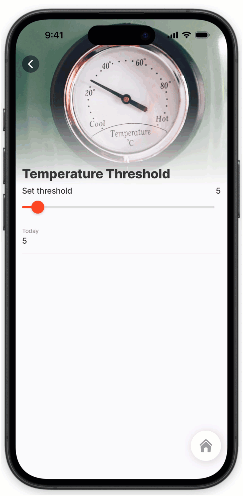
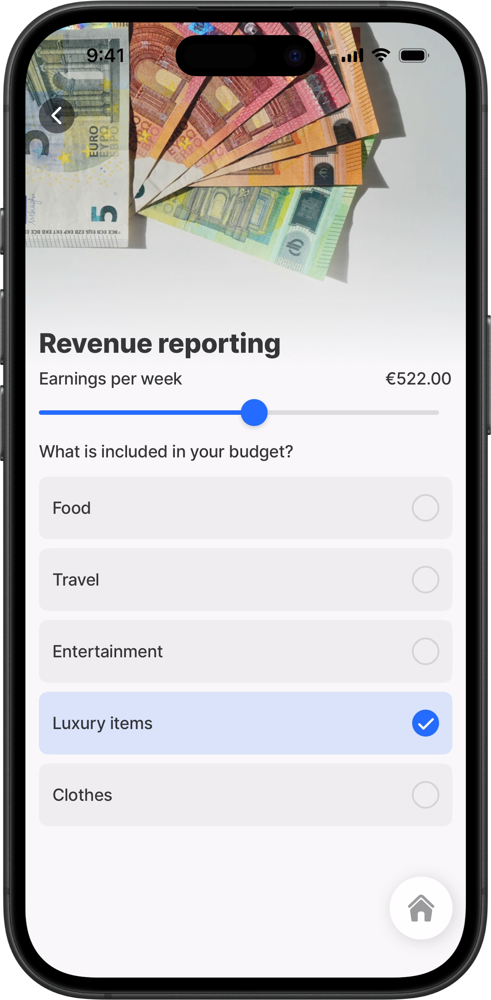
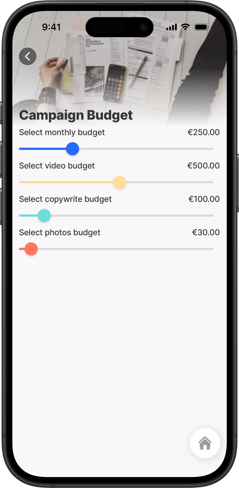

# slider



Use the `slider` component to select a numeric value within a defined range by dragging a thumb control.

Typical use cases include price ranges, quantity selection, thresholds, and score inputs.



<figure><figcaption><p>Slider component</p></figcaption></figure>



## Configuration options

Some properties are common to all components, see [Common component properties](<../../docs/Components/Common component properties.md>) for a list and their configuration options.

<table><thead><tr><th width="199.234375">Core structure</th><th>Description</th></tr></thead><tbody><tr><td><code>instanceId</code></td><td>The unique identifier for the slider component.</td></tr><tr><td><code>label</code></td><td>Provide a label/name for the slider input. Label is displayed above the slider.</td></tr><tr><td><code>minimum</code></td><td>Sets the minimum numeric value of the slider range.</td></tr><tr><td><code>maximum</code></td><td>Sets the maximum numeric value of the slider range.</td></tr><tr><td><code>step</code></td><td>Defines the increment between valid slider values. For example, <code>step: 5</code> allows values in increments of five.</td></tr></tbody></table>

<table><thead><tr><th width="197.9609375">Other options</th><th>Description</th></tr></thead><tbody><tr><td><code>color</code></td><td>Sets the color of the slider track and thumb. Color conditions using the <code>when</code> property enable dynamic color options. The first condition evaluated to true will be used.</td></tr><tr><td><code>displayValue</code></td><td>Controls the value overlay shown for the selected slider value. You can configure formatting, hide the value, set subtle styling, or show custom value text.</td></tr><tr><td><code>errorText</code></td><td>Add text, string, or expressions to show text under the slider indicating an error or invalid value. ErrorText is shown in <code>isNegative</code> styling.</td></tr><tr><td><code>helperText</code></td><td>Add text, strings, or expressions to guide users by displaying text beneath the slider. HelperText is displayed only when there is no <code>errorText</code> property set.</td></tr><tr><td><code>initialValue</code></td><td>The value the slider will load with when the screen initially loads. Use this to preset a default position on the slider.</td></tr><tr><td><code>isHidden</code></td><td>If <code>true</code> the slider will be hidden. If set to <code>false</code> the field will be shown.</td></tr><tr><td><code>isIgnored</code></td><td>When <code>true</code>, the field will be ignored during data save, and the slider value will not be stored. This property is only applied when using the submit-form action.</td></tr><tr><td><code>isRequired</code></td><td>Set to <code>true</code> when the field is required, which is indicated by a grey asterisk. Set to <code>false</code>, the slider is optional.</td></tr><tr><td><code>leftElement</code></td><td>Add a visual context element to the left of the slider. Supported element types are icon or text.</td></tr><tr><td><code>rightElement</code></td><td>Add a visual context element to the right of the slider. Supported element types are icon or text.</td></tr><tr><td><code>style</code></td><td><p>The following property setting is available:</p><ul><li><code>isDisabled</code> - makes the slider read-only.</li></ul></td></tr><tr><td><code>value</code></td><td>The value to show for the slider. This is typically a numeric value representing the selected position. This can be combined with the <code>isDisabled</code> style to preset a value that cannot be changed.</td></tr></tbody></table>

<table><thead><tr><th width="203.73046875">Actions</th><th>Description</th></tr></thead><tbody><tr><td><code>onChange</code></td><td>The action is triggered when the value in the <code>slider</code> is changed. Use IntelliSense (ctrl+space) to see the list of available actions.</td></tr></tbody></table>

<table><thead><tr><th width="211.01953125">State Configuration</th><th width="103.68359375">Key</th><th>Notes</th></tr></thead><tbody><tr><td><code>=@ctx.component.state.</code></td><td>value</td><td>State is the variable of the component.</td></tr></tbody></table>

## Considerations

* The slider supports gesture-based interaction by dragging the thumb control left or right.
* The selected value must stay within the configured `minimum` and `maximum` range.
* Use the `step` property to control how precisely users can select values.
* The component supports haptic feedback when values change.
* The display value overlay is useful when the current value needs to remain visible while dragging.

## Examples and code snippets

### Basic slider



<figure><figcaption><p>Slider with initial value</p></figcaption></figure>



Basic example of a slider configured with a numeric range from 0 to 1000. The selected value is shown as a formatted currency amount in the value overlay.





```yaml
title: Revenue reporting
type: jig.default

header:
  type: component.jig-header
  options:
    height: medium
    children:
      type: component.image
      options:
        source:
          uri: https://images.unsplash.com/photo-1711915482570-a7714a3a4660?q=80&w=870&auto=format&fit=crop&ixlib=rb-4.1.0&ixid=M3wxMjA3fDB8MHxwaG90by1wYWdlfHx8fGVufDB8fHx8fA%3D%3D

children:
  # Basic slider example.
  # The selected slider value is stored in component state:
  #   =@ctx.components.slider7.state.value
  - type: component.slider
    instanceId: slider7
    options:
      isHidden: false
      # Preset the initial slider position.
      initialValue: ="10"
      label: Earnings per week
      # Define the range limits.
      minimum: 0
      maximum: 1000
      # Allow selection in steps of 1.
      step: 1
      # Display the selected value above the thumb.
      displayValue:
        format:
          numberStyle: currency
          currency: EUR
        isHidden: =false
        isSubtle: =false
  - type: component.choice-field
    instanceId: budget-items
    options:
      label: What is included in your budget?
      data: =@ctx.datasources.budget
      item:
        type: component.choice-field-item
        options:
          title: =@ctx.current.item.title
          value: =@ctx.current.item.value

```



```yaml
datasources:
  budget:
    type: datasource.static
    options:
      data:
        - id: 1
          title: Food
          value: Food
        - id: 2
          title: Travel
          value: Travel
        - id: 3
          title: Entertainment
          value: Entertainment
        - id: 4
          title: Luxury items
          value: Luxury items
        - id: 5
          title: Clothes
          value: Clothes
```



### Slider in a form



In this example, the slider is used in a form to capture budget values. The display values are formatted as currency so the selected amount is easy to read while dragging. Each slider is configured with an `initialvalue`.



<figure><figcaption><p>Multiple sliders in a form</p></figcaption></figure>





```yaml
title: Campaign Budget
type: jig.default

header:
  type: component.jig-header
  options:
    height: small
    children:
      type: component.image
      options:
        source:
          uri: https://images.unsplash.com/photo-1554224155-6726b3ff858f?w=400&auto=format&fit=crop&q=60

children:
  - type: component.form
    instanceId: budget-form
    options:
      children:
        - type: component.slider
          instanceId: budget
          options:
            label: Select monthly budget
            minimum: 0
            maximum: 1000
            step: 10
            initialValue: 250
            displayValue:
              format:
                numberStyle: currency
                currency: EUR
              isHidden: false
              isSubtle: false
        - type: component.slider
          instanceId: video-budget
          options:
            label: Select video budget
            minimum: 0
            maximum: 1000
            step: 10
            initialValue: 500
            displayValue:
              format:
                numberStyle: currency
                currency: EUR
              isHidden: false
              isSubtle: false
            color: color3
        - type: component.slider
          instanceId: copywrite-budget
          options:
            label: Select copywrite budget
            minimum: 0
            maximum: 1000
            step: 10
            initialValue: 100
            displayValue:
              format:
                numberStyle: currency
                currency: EUR
              isHidden: false
              isSubtle: false
            color: color12
        - type: component.slider
          instanceId: photos-budget
          options:
            label: Select photos budget
            minimum: 0
            maximum: 1000
            step: 10
            initialValue: 30
            displayValue:
              format:
                numberStyle: currency
                currency: EUR
              isHidden: false
              isSubtle: false
            color: color4
```



### Slider with conditional color



This example uses color conditions to visually indicate low and high temperature values on the slider. The value is written to the&#x20;



<figure><figcaption><p>Slider with conditional colors</p></figcaption></figure>





```yaml
title: Temperature Threshold
type: jig.default

header:
  type: component.jig-header
  options:
    height: medium
    children:
      type: component.image
      options:
        source:
          uri: https://images.unsplash.com/photo-1617713964860-a6ffc37721a1?q=80&w=1470&auto=format&fit=crop&ixlib=rb-4.1.0&ixid=M3wxMjA3fDB8MHxwaG90by1wYWdlfHx8fGVufDB8fHx8fA%3D%3D

children:
  - type: component.slider
    instanceId: threshold
    options:
      label: Set threshold
      minimum: 0
      maximum: 100
      step: 5
      initialValue: 50
      color:
        - when: =@ctx.component.state.value < 30
          color: negative
        - when: =@ctx.component.state.value >= 30 and @ctx.component.state.value < 70
          color: warning
        - when: =@ctx.component.state.value >= 70
          color: positive
      displayValue:
        isHidden: false
        isSubtle: false
  - type: component.entity
    options:
      children:
        - type: component.entity-field
          options:
            label: Today's temperature threshold
            value: =@ctx.components.threshold.state.value

```


