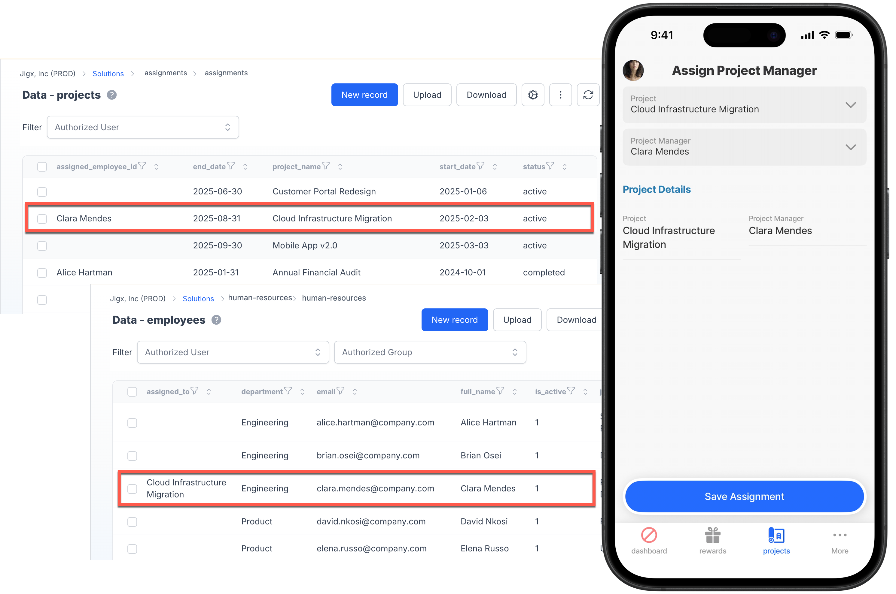

---
layout:
  width: wide
  title:
    visible: true
  description:
    visible: true
  tableOfContents:
    visible: true
  outline:
    visible: true
  pagination:
    visible: true
  metadata:
    visible: true
  tags:
    visible: true
---

# Cross solution datasource access

Jigx solutions are self-contained by default, but there are scenarios where one solution needs to read data from, or trigger actions in, another installed solution. Cross-package support makes this possible without duplicating data or creating custom sync pipelines. See [Cross-solution datasource access](https://docs.jigx.com/building-apps-with-jigx/data/datasources/cross-solution-data-access) to learn more about the configuration options.

## Examples and code snippets

<figure><figcaption><p>Cross solution datasource and action access</p></figcaption></figure>

This example demonstrates how to configure and use cross-solution datasource and action access between two solutions: **Assignments** and **Human-Resources**.

The **Assignments** solution contains a `projects` table as part of its datasource configuration, while the **Human-Resources** solution contains an `employees` table.

Within the Assignments solution, a `manager` datasource is configured using the `package` and `entity` properties to access employee data (name and id) from the Human-Resources solution. This datasource is used to populate a Project Manager dropdown list. A second datasource, `project-details`, retrieves project data from the local Assignments solution to populate a Project dropdown.

The jig (assign-project-manager.jigx) includes two `dropdown` fields:

* A Project dropdown populated from the `projects` table.
* A Project Manager dropdown populated from the HR solution’s `employees` table.

Once selections are made, two `actions` are triggered:

1. A local `execute-entities` action in the Assignments solution updates the selected project table with the project manager’s name.
2. A cross-solution action calls the global `execute-actions` action from the Human-Resources solution to update the `assigned_to` column in the `employees` table with the project name.

This example demonstrates how solutions can securely share both data and actions across packages. More complex scenarios can be configured where local and cross-package data can be combined within the same SQL query using operations such as `JOIN` or `UNION ALL`.

### Assignments Solution



```yaml
type: datasource.sqlite
options:
  provider: DATA_PROVIDER_DYNAMIC
  entities:
    - entity: default/projects
  query: |
    SELECT
      P.id AS id,
      json_extract(P.data, '$.project_id') AS project_id,
      json_extract(P.data, '$.project_name') AS project_name,
      json_extract(P.data, '$.status') AS status,
      json_extract(P.data, '$.start_date') AS start_date,
      json_extract(P.data, '$.end_date') AS end_date,
      json_extract(P.data, '$.assigned_employee_id') AS assigned_employee_id
    FROM [default/projects] AS P
    WHERE json_extract(P.data, '$.status') != 'archived'
    ORDER BY json_extract(P.data, '$.project_name')
```



```yaml
type: datasource.sqlite
options:
  provider: DATA_PROVIDER_DYNAMIC
  entities:
    # Configure the datasource to use the data from the HR solution
    - entity: default/employees
      # Provide the name of the other solution as the package value  
      package: human-resources
  query: |
    SELECT
      E.id AS id,
      json_extract(E.data, '$.id') AS employee_id,
      json_extract(E.data, '$.full_name') AS full_name,
      json_extract(E.data, '$.email') AS email,
      json_extract(E.data, '$.department') AS department,
      json_extract(E.data, '$.job_title') AS job_title
    FROM [human-resources].[default/employees] AS E
    WHERE json_extract(E.data, '$.is_active') = 1
    ORDER BY json_extract(E.data, '$.full_name')
```



```yaml
title: Assign Project Manager
type: jig.default

children:
  - type: component.form
    instanceId: assign-pm-form
    options:
      children:
        # Configure the project dropdown to use the assignment solution
        - type: component.dropdown
          instanceId: project-select
          options:
            label: Project
            isRequired: true
            data: =@ctx.datasources.projects-details
            item:
              type: component.dropdown-item
              options:
                title: =@ctx.current.item.project_name
                value: =@ctx.current.item.project_name
                subtitle: =('Status- ' & @ctx.current.item.status & '  |  Start- ' & @ctx.current.item.start_date)
        # Configure the project manager dropdown to use the
        # employee datasource from the Human-resources solution. 
        - type: component.dropdown
          instanceId: employee-select
          options:
            label: Project Manager
            isRequired: true
            data: =@ctx.datasources.managers
            item:
              type: component.dropdown-item
              options:
                title: =@ctx.current.item.full_name
                value: =@ctx.current.item.full_name
                subtitle: =(@ctx.current.item.department & '  ·  ' & @ctx.current.item.job_title)
  - type: component.section
    options:
      title:
        text: Project Details
        fontSize: regular
        color: color1
        isSubtle: false
        isBold: true
        numberOfLines: 1
        transform: none
      children:
        - type: component.entity
          options:
            children:
              - type: component.field-row
                options:
                  children:
                    - type: component.entity-field
                      options:
                        label: Project
                        value: =@ctx.components.project-select.state.selected.project_name
                    - type: component.entity-field
                      options:
                        label: Project Manager
                        value: =@ctx.components.employee-select.state.selected.full_name
actions:
  - numberOfVisibleActions: 1
    children:
      - type: action.action-list
        options:
          title: Save Assignment
          isSequential: true
          actions:
            # Configure the first action to save the selected manager name
            # with the selected project in the projects table. 
            - type: action.execute-entity
              options:
                provider: DATA_PROVIDER_DYNAMIC
                entity: default/projects
                method: update
                goBack: previous
                data:
                  id: =@ctx.components.project-select.state.selected.id
                  assigned_employee_id: =@ctx.components.employee-select.state.value
                onSuccess:
                  type: action.action-list
                  options:
                    isSequential: true
                    actions:
                      - type: action.show-alert
                        options:
                          icon: check
                          style:
                            isPositive: true
                          title: Project Manager Assigned Successfully
                          presentAs: modal
            # In the second action, call the global datasource from the 
            # human-resources solution (package). Pass the employee_id and the 
            # project_name as parameters that will be used in the global action
            # to save the project with the associated employee in the employee table.                 
            - type: action.execute-action
              options:
                package: human-resources
                action: assign
                parameters:
                  employee_id: =@ctx.components.employee-select.state.selected.id
                  project_name: =@ctx.components.project-select.state.selected.project_name

```



### Human-Resources Solution



```yaml
# Global action configured to save the project name witht he associated employee.
action:
  type: action.execute-entities
  options:
    provider: DATA_PROVIDER_DYNAMIC
    entity: default/employees
    method: update
    data:
      id: =@ctx.action.parameters.employee_id
      assigned_to: =@ctx.action.parameters.project_name
parameters:
  employee_id:
    type: string
    required: true
  project_name:
    type: string
    required: true
```


