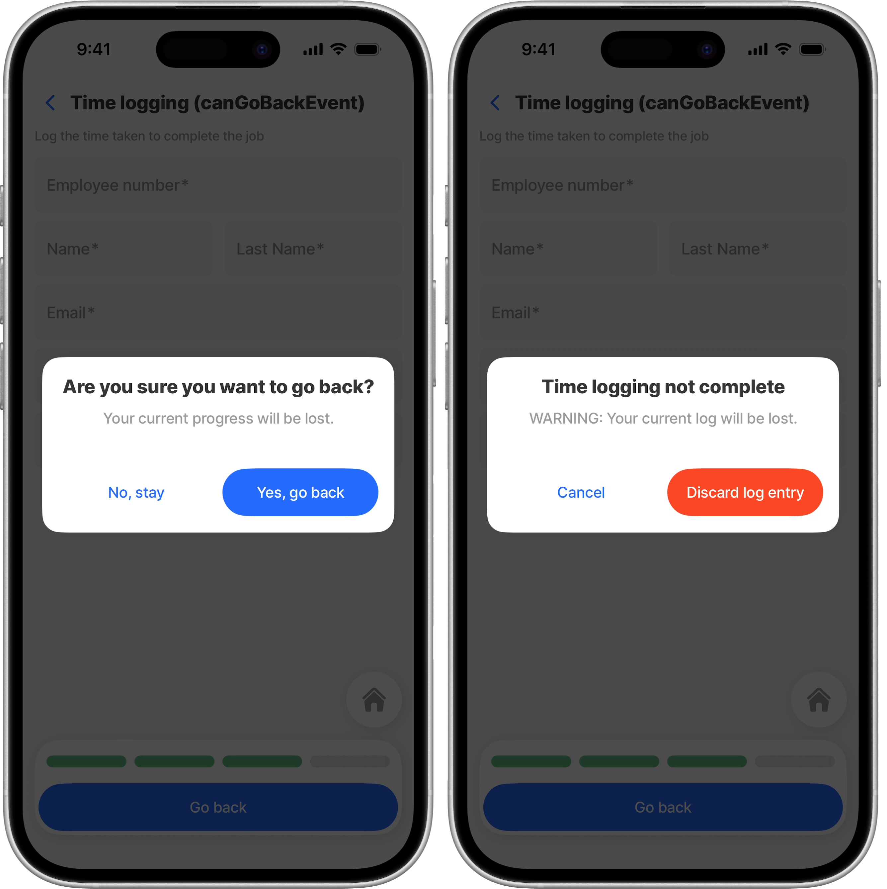

# canGoBack



Use `canGoBack` on a jig to control whether users can leave the current screen.

It applies to all user-initiated back navigation from that jig, including:

* Android hardware back
* iOS swipe-back
* The header back button
* [`action.go-back`](../../docs/Actions/go-back.md) and `action.go-to` triggered from the jig



<figure><figcaption></figcaption></figure>





### Where to use it

Configure `canGoBack` on any [jig type](<../../docs/Jig Types/Jig Types.md>).

Use it when you need to:

* confirm before leaving a read-only screen
* protect unsaved changes across multiple components
* block navigation in kiosk-style flows

### How it works

`canGoBack` has a required `when` condition and an optional `confirm` modal.

It resolves in three ways:

* `when` is `true` — navigation proceeds
* `when` is `false` and `confirm` is set — a modal opens
* `when` is `false` and `confirm` is not set — navigation is blocked

### Configuration options

| Property                 | Type                      | Description                                           |
| ------------------------ | ------------------------- | ----------------------------------------------------- |
| `when`                   | `boolean` or `Expression` | Controls whether the user can leave the jig.          |
| `confirm`                | `object`                  | Optional modal shown when `when` resolves to `false`. |
| `confirm.title`          | `string` or `Expression`  | Modal title.                                          |
| `confirm.description`    | `string` or `Expression`  | Modal body text.                                      |
| `confirm.confirm`        | `string` or `Expression`  | Confirm button label.                                 |
| `confirm.cancel`         | `string` or `Expression`  | Cancel button label.                                  |
| `confirm.style.isDanger` | `boolean`                 | Styles the confirm button as a destructive action.    |


Use `canGoBack` when the whole jig owns the navigation rule. Use [`component.form`](../../docs/Components/form/form.md) when you only need the form discard alert.


### Considerations

* It does not run in widgets, previews, or nested jig content.
* In [`jig.tabs`](<../../docs/Jig Types/jig_tabs.md>), an inactive tab can still block leaving the screen.
* If a form still uses `isDiscardChangesAlertEnabled: true`, the form discard alert still applies.
* Use a hard block carefully. It prevents all supported back navigation from that jig.

### Examples

#### Confirm before leaving

This example blocks navigation when the jig is dirty and asks the user to confirm.

```yaml
title: Edit notes
type: jig.default

canGoBack:
  when: =$not(@ctx.jig.state.dirty)
  confirm:
    title: Discard unsaved changes?
    description: Your notes will be lost.
    confirm: Discard
    cancel: Keep editing
    style:
      isDanger: true
```

#### Hard block navigation

This example prevents leaving the jig with no modal.

```yaml
title: Check-in kiosk
type: jig.default

canGoBack:
  when: false
```

#### Use a form's dirty state

This example moves the back-navigation rule to the jig level and uses the form state in the condition.

```yaml
title: Profile
type: jig.default

canGoBack:
  when: =@ctx.components.profile-form.state.isDirty
  confirm:
    title: Leave this form?
    description: Your changes have not been saved.
    confirm: Leave
    cancel: Stay

children:
  - type: component.form
    instanceId: profile-form
    options:
      isDiscardChangesAlertEnabled: false
      children:
        - type: component.text-field
          instanceId: first-name
          options:
            label: First name
```

#### `action.go-back` uses the same rule

This example shows a back action inside the jig. The same `canGoBack` rule still applies, even when the action button is tapped.

```yaml
title: Edit notes
type: jig.default

canGoBack:
  when: =$not(@ctx.jig.state.dirty)
  confirm:
    title: Discard unsaved changes?
    description: Your notes will be lost.
    confirm: Discard
    cancel: Keep editing

actions:
  - children:
      - type: action.go-back
        options:
          title: Go back
```

###

### Related topics

* [confirm](../../docs/Actions/confirm.md)
* [go-back](../../docs/Actions/go-back.md)
* [form](../../docs/Components/form/form.md)
