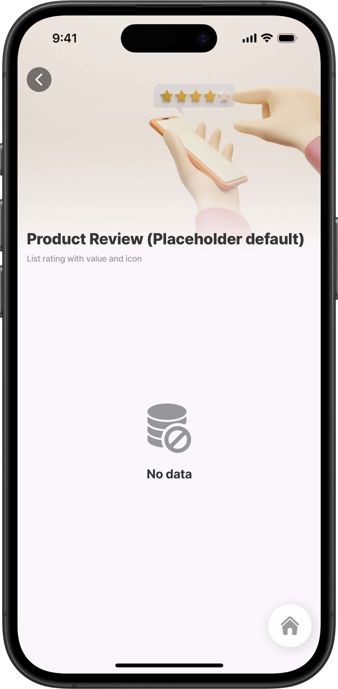
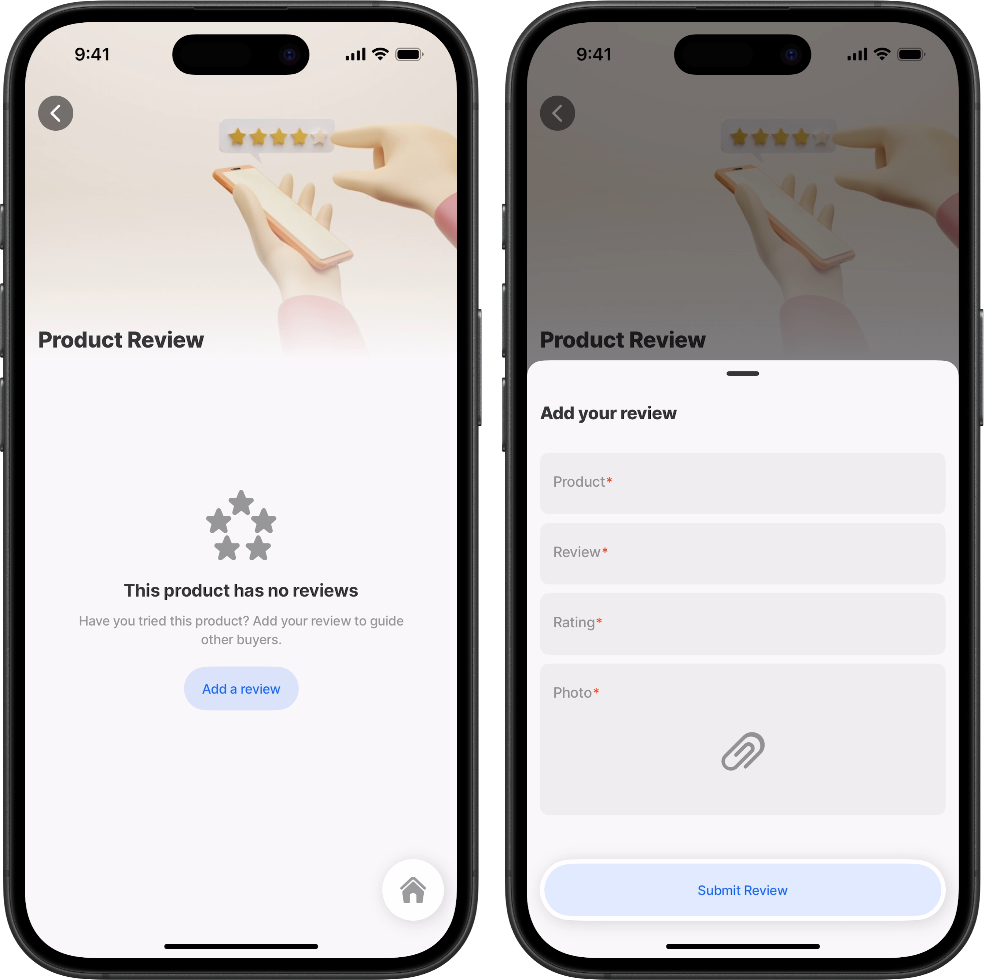
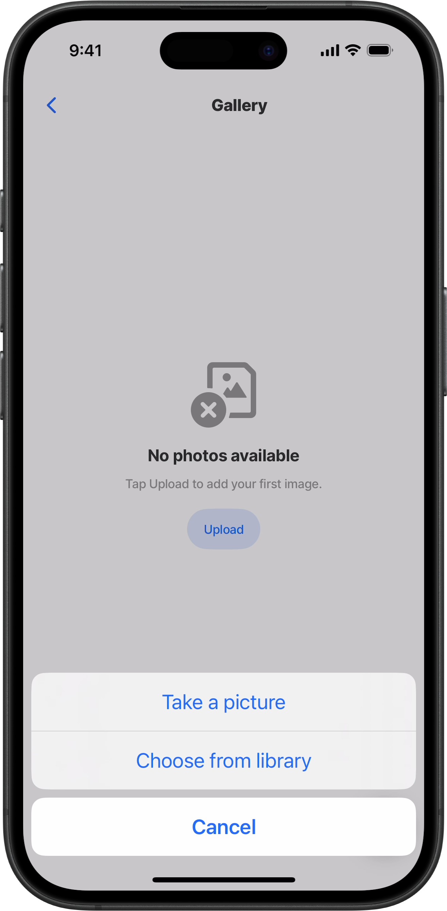
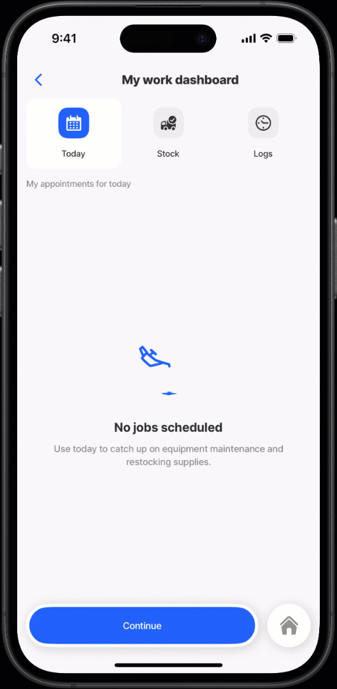
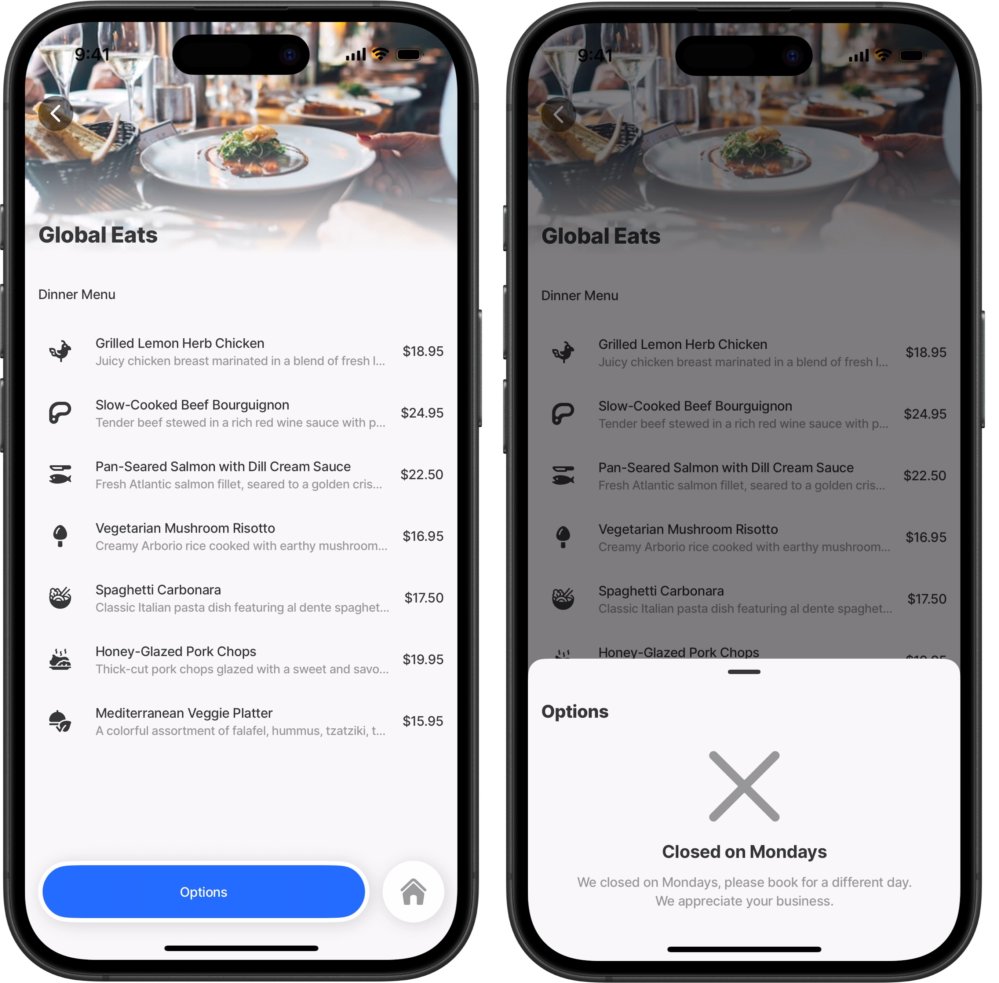

# placeholders

The placeholders property can be added to the root YAML of any jig-type to define what displays when a screen has no data. It appears automatically for empty screens and is fully customizable. Configure your own text, description, icon, or choose from a set of built-in animated icons to create a more engaging user experience.

## Configuration options

<table><thead><tr><th width="239.08984375">Core Structure</th><th></th></tr></thead><tbody><tr><td><code>icon</code></td><td><p>The icon is shown above the <code>title</code>. You can use any supported <a href="https://docs.jigx.com/understanding-the-basics/jigx-icons">icon</a> name or animated placeholder icons to visually reinforce the message. The list of animated icons displays when you use  IntelliSense, and include:</p><ul><li>helicopter</li><li>is-offline</li><li>loading-data</li><li>missing-data</li><li>oil-drop</li><li>scan-qr</li></ul></td></tr><tr><td><code>title</code></td><td>The main heading displayed in the placeholder. Use this to briefly explain the empty state (e.g., <em>No data to display</em>).</td></tr><tr><td><code>when</code></td><td>An expression that determines when this placeholder should be displayed. The placeholder will only render when this condition evaluates to true.</td></tr></tbody></table>

<table><thead><tr><th width="242.61328125">Other options</th><th></th></tr></thead><tbody><tr><td><code>description</code></td><td>Additional text that provides more context or guidance to the user about why no data is available or what action to take next.</td></tr><tr><td><code>onPress</code></td><td>Defines an action or list of actions to run when the placeholder's action button is pressed. Useful for prompting a retry, refresh, upload data, or navigate to another screen.</td></tr></tbody></table>

## Considerations

* For screens that rely on array-based data (such as lists or dropdown components), a default placeholder is shown automatically when no data is returned. You can override or customize this behavior by defining your own placeholder property.
* You can configure multiple placeholders within a single jig, but only one will display at a time. Use the `when` property to define the conditions that determine which placeholder should appear.

## Examples and code snippets

### Default placeholder in a list



<figure><figcaption><p>Default placeholder</p></figcaption></figure>



In this example, the list has no data, so a default placeholder is shown automatically. No custom placeholder is configured. The default placeholder is applied to any jig/component configured with array-based data (e.g. list, dropdown).





```yaml
title: Product Review (Placeholder default)
description: List rating with value and icon
type: jig.list
icon: contact

header:
  type: component.jig-header
  options:
    height: medium
    children:
      type: component.image
      options:
        source:
          uri: https://plus.unsplash.com/premium_photo-1682309642428-3f8b37637434?w=900&auto=format&fit=crop&q=60&ixlib=rb-4.0.3&ixid=M3wxMjA3fDB8MHxzZWFyY2h8NXx8cmF0aW5nc3xlbnwwfHwwfHx8MA%3D%3D

data: =@ctx.datasources.product-review
item:
  type: component.list-item
  options:
    title: =@ctx.current.item.title
    subtitle: =@ctx.current.item.subtitle
    avatars: =@ctx.datasources.product-users[product =
      @ctx.current.item.id].{"text":text,"uri":avatars}[]
    description: =@ctx.current.item.thirdLine
    isContained: true
    label:
      title: =@ctx.current.item.label
    leftElement:
      element: avatar
      text: ""
      uri: =@ctx.current.item.productImage
    rating:
      value: =@ctx.current.item.rating
      ratingIcon:
        color: color3
        current: =@ctx.current.item.ratingValue
        icon: rating-star-1
        maximum: 5

```



```yaml
type: datasource.sqlite
options:
  provider: DATA_PROVIDER_DYNAMIC

  entities:
    - default/product-review

  query: |
    SELECT 
      id,
      '$.title', 
      '$.subtitle',
      '$.avatars',
      '$.label',
      '$.productImage',
      '$.rating',
      '$.ratingValue',
      '$.ratingText',
      '$.tags',
      '$.thirdLine' 
    FROM [default/product-review]
```



### Customized placeholder in a list



In this example, the list has no data, so a customized `placeholder` is displayed. The placeholder includes a `title` and `icon` relevant to the screen’s context. A `description` provides additional guidance, prompting the user to add a review. An `onPress` action is configured with a go-to action that opens the review form as a modal, allowing the user to submit a new review.



<figure><figcaption><p>Customized list placeholder</p></figcaption></figure>





```yaml
title: Product Review
type: jig.list
icon: contact

header:
  type: component.jig-header
  options:
    height: medium
    children:
      type: component.image
      options:
        source:
          uri: https://plus.unsplash.com/premium_photo-1682309642428-3f8b37637434?w=900&auto=format&fit=crop&q=60&ixlib=rb-4.0.3&ixid=M3wxMjA3fDB8MHxzZWFyY2h8NXx8cmF0aW5nc3xlbnwwfHwwfHx8MA%3D%3D
# Define a placeholder that displays when there is no data in the list.
placeholders:
  # Placeholder message shown when a product has no reviews yet.
  - title: This product has no reviews
    description: Have you tried this product? Add your review to guide other buyers.
    # Icon displayed with the placeholder 
    icon: rating-five-star
    # Condition to show this placeholder (true = always show when no reviews exist)
    when: true
    # Add an action button to the placeholder message.
    onPress:
      # Navigate to another screen to capture a review.
      type: action.go-to
      options:
        title: Add a review
        # Screen to navigate to.
        linkTo: placeholder-review
        style:
          isSecondary: true
        # Display the jig as a modal overlay instead of full screen navigation.  
        isModal: true

data: =@ctx.datasources.product-review
item:
  type: component.list-item
  options:
    title: =@ctx.current.item.title
    subtitle: =@ctx.current.item.subtitle
    avatars: =@ctx.datasources.product-users[product =
      @ctx.current.item.id].{"text":text,"uri":avatars}[]
    description: =@ctx.current.item.thirdLine
    isContained: true
    label:
      title: =@ctx.current.item.label
    leftElement:
      element: avatar
      text: ""
      uri: =@ctx.current.item.productImage
    rating:
      value: =@ctx.current.item.rating
      ratingIcon:
        color: color3
        current: =@ctx.current.item.ratingValue
        icon: rating-star-1
        maximum: 5

```



```yaml
title: Add your review
type: jig.default

header:
  type: component.jig-header
  options:
    height: medium
    children:
      type: component.image
      options:
        source:
          uri: https://plus.unsplash.com/premium_photo-1682309642428-3f8b37637434?w=900&auto=format&fit=crop&q=60&ixlib=rb-4.0.3&ixid=M3wxMjA3fDB8MHxzZWFyY2h8NXx8cmF0aW5nc3xlbnwwfHwwfHx8MA%3D%3D

children:
  - type: component.form
    instanceId: review-form
    options:
      isDiscardChangesAlertEnabled: false
      children:
        - type: component.text-field
          instanceId: title
          options:
            label: Product
        - type: component.text-field
          instanceId: subtitle
          options:
            label: Review
        - type: component.number-field
          instanceId: rating
          options:
            label: Rating
            maximum: 5
        - type: component.media-field
          instanceId: productImage
          options:
            mediaType: image
            label: Photo
actions:
  - numberOfVisibleActions: 2
    children:
      - type: action.execute-entity
        options:
          title: Submit Review
          provider: DATA_PROVIDER_DYNAMIC
          entity: default/product-review
          method: create
          data:
            title: =@ctx.components.title.state.value
            subtitle: =@ctx.components.subtitle.state.value
            productImage: =@ctx.components.productImage.state.value
            rating: =@ctx.components.rating.state.value
          style:
            isSecondary: true

```



### Placeholder in a gallery



<div align="center"><figure><figcaption><p>Placeholder in a gallery jig</p></figcaption></figure></div>



In this example, the gallery jig has no images to display. A placeholder is configured with a `title` and an `icon` that match the screen’s purpose. The `description` offers helpful guidance by prompting the user to upload photos. An `onPress` action is included, using the `open-media-picker` action to let the user add images directly.





```yaml
title: Gallery
type: jig.gallery

# Define placeholder that displays when certain there is no data.
placeholders:
  # Placeholder message shown when there are no images yet.
  - title: No photos available
    description: Tap Upload to add your first image.
    # Icon displayed with the placeholder. 
    icon: no-image
    # Condition to show this placeholder (true = always show when no images)
    when: true
    # Add an action button to the placeholder message.
    onPress:
      # Action to open the media-picker and take an image.
      type: action.open-media-picker
      options:
        title: Upload
        mediaType: image
        imageCropping:
          isFreeStyleCropEnabled: true

data: =@ctx.datasources.data-placeholders
item:
  type: component.gallery-item
  options:
    imageUri: =@ctx.current.item.image
```



```yaml
type: datasource.sqlite
options:
  provider: DATA_PROVIDER_DYNAMIC
  entities:
    - default/placeholders

  query: SELECT
    id,
    '$.description',
    '$.name',
    '$.image',
    '$.type'
    FROM [default/placeholders]
```



### Placeholder (animated) in a tabs jig



In this example, a work dashboard is configured with three tabs. The first tab displays all scheduled appointments for the day. If no appointments are scheduled, a customised placeholder is shown, featuring an animated `icon` and a helpful `description`. The description suggests that the field worker use the day for equipment maintenance and stock-taking.



<figure><figcaption><p>Animated placeholders in tabs</p></figcaption></figure>





<pre class="language-yaml"><code class="lang-yaml"># Supporting jig - First tab corresponding jig
title: Today
description: My appointments for today
type: jig.default
# Define placeholder that displays when there are no appointments scheduled.
placeholders:
  # Placeholder message shown when there are no scheduled appointments.
  - title: No jobs scheduled
    # Add a animated icon.
    icon: oil-drop
    # Provide additional information for the day.
    description: Use today to catch up on equipment maintenance and restocking supplies.
    when: true
    
<strong># Datasource with no appointment data.    
</strong>datasources:
  appointments:
    type: datasource.static
    options:
      data:
        - id: 1
          time:
          customer:
          address:
     
children:
  - type: component.form
    instanceId: schedule-appt
    options:
      isDiscardChangesAlertEnabled: false
      children:
        - type: component.choice-field
          instanceId: appointment
          options:
            label: Today
            data: =@ctx.datasources.appointments
            item:
              type: component.choice-field-item
              options:
                title: =@ctx.current.item.customer
                value: =@ctx.current.item.address

</code></pre>



```yaml
title: My work dashboard
type: jig.tabs
areTabsScrollable: false

# Specify the jigs that will open in each tab.
children:
  - jigId: appointments
    instanceId: appointments
    tab:
      type: component.tab-button
      options:
        title: Today
        # Add an icon to the tab. The title is diplayed below the icon.
        # When active the icon uses the primary color.
        icon: calendar-3
  - jigId: inventory
    instanceId: inventory
    tab:
      type: component.tab-button
      options:
        title: Stock
        # Add an icon to the tab. The title is diplayed below the icon.
        icon: supply-chain-shipping-fee-included-truck
  - jigId: timelogs
    instanceId: timelogs
    tab:
      type: component.tab-button
      options:
        title: Logs
        # Add an icon to the tab. The title is diplayed below the icon.
        icon: time-clock-circle-1-alternate
  
actions:
  - numberOfVisibleActions: 1
    children:
      - type: action.action-list
        options:
          isHidden: =@ctx.jig.state.activeTabId ="inventory"
          title: Continue
          isSequential: false
          actions:
            - type: action.info-modal
              when: =@ctx.jig.state.activeTabId ="timelogs"
              options:
                modal:
                  title: Successfully submitted
                  buttonText: Exit
                  element:
                    type: icon
                    icon: check-2
                    color: positive
            - type: action.open-map
              when: =@ctx.jig.state.activeTabId ="appointments"
              options:
                title: Directions
                address: 105 Othello Dr, Woodstock, GA 30189, United States
```



```yaml
# Supporting jig - Second tab's corresponding jig
title: Inventory
description: Select the parts required for the job
type: jig.list

datasources:
  inventory:
    type: datasource.static
    options:
      data:
        - id: 1
          item: Compressor
        - id: 2
          item: Condenser Coil
        - id: 3
          item: Refrigerant
        - id: 4
          item: Expansion Valve
        - id: 5
          item: Fan Motor

data: =@ctx.datasources.inventory
item:
  type: component.list-item
  options:
    title: =@ctx.current.item.item
    leftElement:
      element: icon
      icon: tool-organizer-1

```



```yaml
# Supporting jig - Third tab's corresponding jig
title: Time logging
description: Log the time taken to complete the job
type: jig.default

onRefresh:
  type: action.reset-state
  options:
    state: =@ctx.components.shift-form.state.data

children:
  - type: component.form
    instanceId: shift-form
    options:
      children:
        - type: component.number-field
          instanceId: employee-number
          options:
            label: Employee number
        - type: component.field-row
          options:
            children:
              - type: component.text-field
                instanceId: firstName
                options:
                  label: Name
              - type: component.text-field
                instanceId: lastName
                options:
                  label: Last Name
        - type: component.email-field
          instanceId: email
          options:
            label: Email
        - type: component.text-field
          instanceId: contact
          options:
            textContentType: telephoneNumber
            label: Contact number
        - type: component.field-row
          options:
            children:
              - type: component.date-picker
                instanceId: shift-date
                options:
                  label: Select shift date
              - type: component.duration-picker
                instanceId: shift-duration
                options:
                  label: Log your shift duration
                  initialValue: 14400
                  helperText: Standard shift is 4 hours
                  errorText: =@ctx.component.state.value > 14400 ? 'Shift time needs approval':''
                  hours:
                    step: 4
                  minutes:
                    step: 2

```



### Placeholders in a bottomSheet



<figure><figcaption></figcaption></figure>



In this example, the placeholder is configured to display only when a specific condition is met, in this case, when the current day is Monday. The `when` expression evaluates the day of the week, and if it matches Monday, the placeholder appears. On any other day, the placeholder is hidden, and users will instead see the available options for selection.





```yaml
# Jig that opens in the bottomSheet.
title: Options
type: jig.default

datasources:
  restaurant-options:
    type: datasource.static
    options:
      data:
        - id: 1
          booking: Dine-in
          icon: restaurant-seat
        - id: 2
          booking: Takeaway
          icon: food-delivery-bag
        - id: 3
          booking: Delivery
          icon: restaurant-food-truck
          
placeholders:
  - title: Closed on Mondays
    icon: close-big
    description: We closed on Mondays, please book for a different day. We appreciate your business.
    when: =$fromMillis($toMillis(date), '[FNn]') = 'Monday'
children:
  - type: component.form
    instanceId: rest-options
    options:
      isDiscardChangesAlertEnabled: false
      children:
        - type: component.choice-field
          instanceId: eating-options
          options:
            itemsPerRow: 3
            label: Restaurant options
            data: =@ctx.datasources.restaurant-options
            item:
              type: component.choice-field-item
              options:
                title: =@ctx.current.item.booking
                value: =@ctx.current.item.booking

```



```yaml
title: Global Eats
type: jig.default

header:
  type: component.jig-header
  options:
    height: small
    children:
      type: component.image
      options:
        source:
          uri: https://images.unsplash.com/photo-1414235077428-338989a2e8c0?w=500&auto=format&fit=crop&q=60&ixlib=rb-4.0.3&ixid=M3wxMjA3fDB8MHxzZWFyY2h8OHx8cmVzdHVyYW50JTIwZm9vZHxlbnwwfHwwfHx8MA%3D%3D

children:
  - type: component.section
    options:
      title: Dinner Menu
      children:
        - type: component.list
          options:
            data: =@ctx.datasources.menu-list
            maximumItemsToRender: 8
            item:
              type: component.list-item
              options:
                title: =@ctx.current.item.option
                subtitle: =@ctx.current.item.description
                leftElement:
                  element: icon
                  icon: =@ctx.current.item.icon
                rightElement:
                  element: value
                  text: =@ctx.current.item.price
# Configure the jig that will open as the bottomSheet.
# Use the jigId to specify the jig by name that will open in the bottomSheet.
bottomSheet:
  children:
    - jigId: options

# Configuring a bottomSheet requires that the go-to action be set,
# with the same jig name as in the jigId specified in the linkTo property.
# isModal set to true is required for the jig to open in the bottomSheet,
# if not set, then normal navigation will take place.
actions:
  - children:
      - type: action.go-to
        options:
          title: Options
          linkTo: options
          isModal: true

```



```yaml
datasources:
  menu-list:
    type: datasource.static
    options:
      data:
        - id: 1
          option: Grilled Lemon Herb Chicken
          description: Juicy chicken breast marinated in a blend of fresh lemon, rosemary, thyme, and garlic. Grilled to perfection and served with roasted vegetables and a side of garlic mashed potatoes.
          price: $18.95
          icon: chicken-body
        - id: 2
          option: Slow-Cooked Beef Bourguignon
          description: Tender beef stewed in a rich red wine sauce with pearl onions, carrots, and mushrooms. Accompanied by buttered egg noodles or crusty bread for dipping.
          price: $24.95
          icon: barbecue-steak
        - id: 3
          option: Pan-Seared Salmon with Dill Cream Sauce
          description: Fresh Atlantic salmon fillet, seared to a golden crisp, topped with a creamy dill and lemon sauce. Served with wild rice pilaf and steamed asparagus.
          price: $22.50
          icon: fishing-bait-fish
        - id: 4
          option: Vegetarian Mushroom Risotto
          description: Creamy Arborio rice cooked with earthy mushrooms, white wine, and parmesan cheese. Garnished with fresh parsley and a drizzle of truffle oil.
          price: $16.95
          icon: vegetable-mushroom-2
        - id: 5
          option: Spaghetti Carbonara
          description: Classic Italian pasta dish featuring al dente spaghetti tossed with crispy pancetta, eggs, and Parmesan cheese. Finished with freshly cracked black pepper.
          price: $17.50
          icon: asian-food-noodle-ramen-bowl
        - id: 6
          option: Honey-Glazed Pork Chops
          description: Thick-cut pork chops glazed with a sweet and savory honey-mustard sauce. Served with roasted sweet potatoes and sautéed green beans.
          price: $19.95
          icon: asian-food-barbeque-sucking-pork-roasted
        - id: 7
          option: Mediterranean Veggie Platter
          description: A colorful assortment of falafel, hummus, tzatziki, tabbouleh, and warm pita bread. Paired with a Greek salad of cucumbers, tomatoes, olives, and feta cheese.
          price: $15.95
          icon: vegan-vegetarian-food-dome
```


