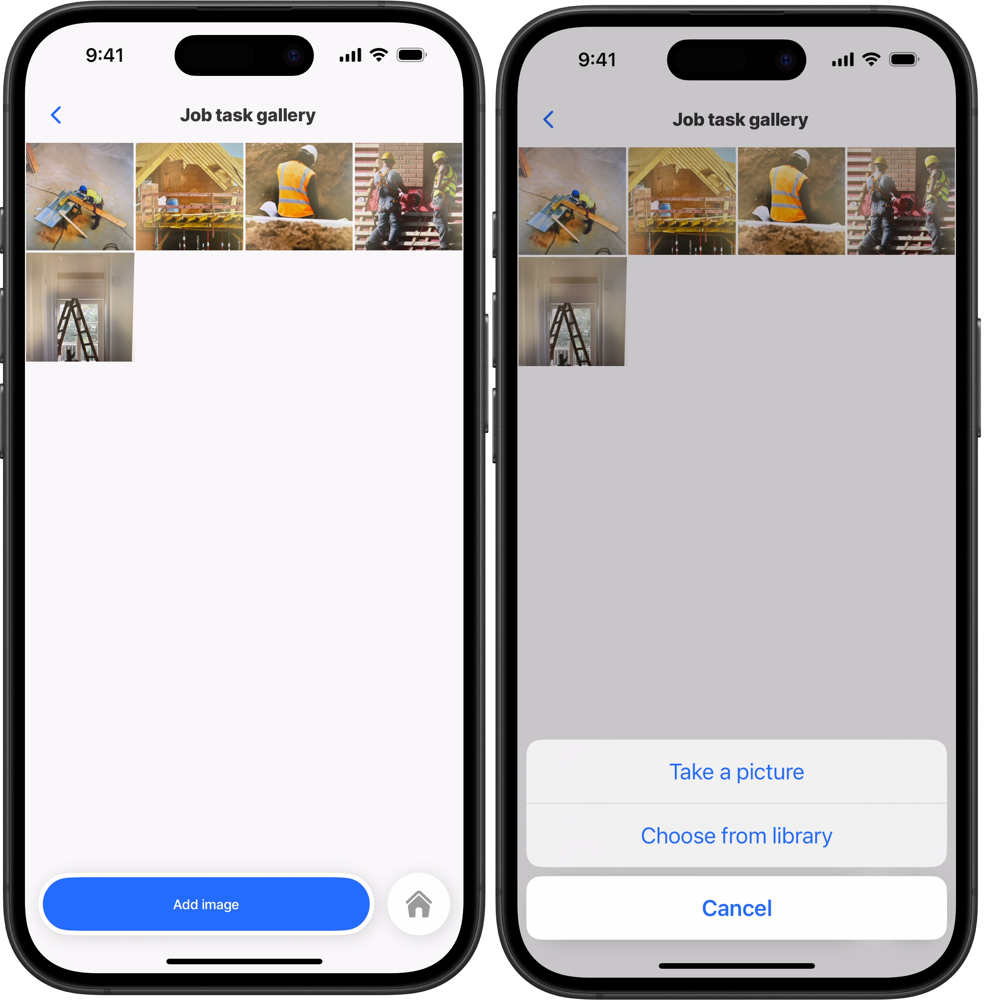
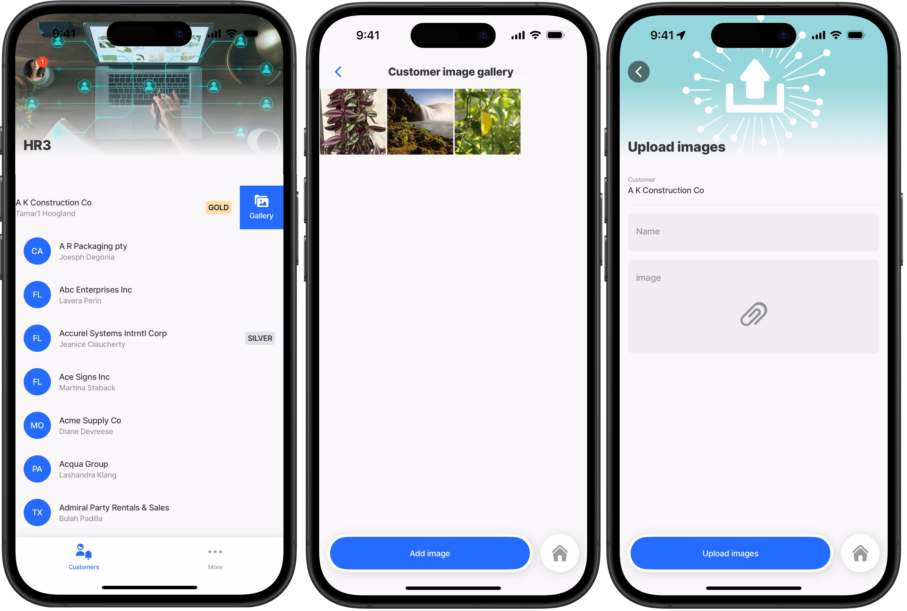
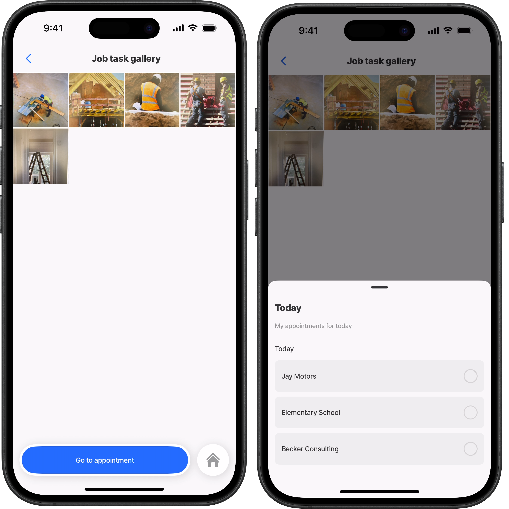
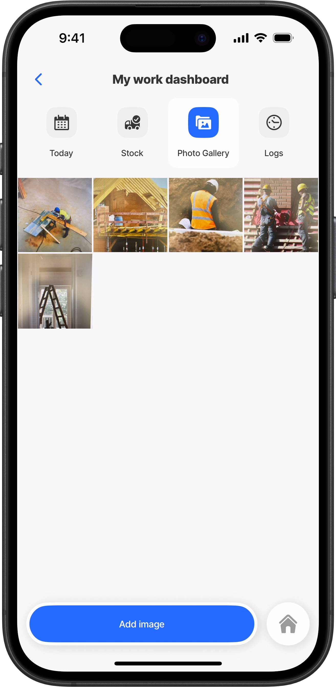

---
layout:
  width: wide
  title:
    visible: true
  description:
    visible: true
  tableOfContents:
    visible: true
  outline:
    visible: true
  pagination:
    visible: true
  metadata:
    visible: true
---

# jig.gallery



The `jig.gallery` provides a way to browse and swipe through a collection of images. This gallery fetches data dynamically from a datasource and presents each image as a gallery item, allowing users to view, share, or delete each item. This control is ideal for showcasing visual collections with interactive features, such as product catalogs or job-related images.&#x20;



<figure><figcaption><p>Image gallery</p></figcaption></figure>



## Usage

Use the `gallery` component when you need to:

* Display a collection of images from a datasource.
* Allow users to interact with each item (e.g., share, delete, or navigate).
  1. Tap on a thumbnail to view the image in fullscreen mode. The selected image opens with share and delete icons visible.
  2. Supports horizontal swiping to scroll through multiple images. The total image count is displayed at the top.
  3. Pinch and zoom on the current image for detailed viewing.
  4. Close the full screen view fullscreen view by swiping down or tapping the back arrow.

## Configuration options

The `jig.gallery` creates a gallery layout from a datasource. The YAML structure is similar in configuration to the [jig.list](<../../docs/Jig Types/jig_list.md>) or jig.grid where a single `gallery-item` is configured and iterates through the datasource. Some properties are common to all jig types, see [Common jig type properties](<../../docs/Jig Types/Common jig type properties.md>) for a list and their configuration options.

<table><thead><tr><th width="153.12890625">Core structure</th><th></th></tr></thead><tbody><tr><td><code>title</code></td><td>Give the jig a title that is displayed at the top of the screen. If you do not want to show a title in a jig use <code>title: ' '</code>.</td></tr><tr><td><code>type</code></td><td>Specifies the control type. Here, it is set to <code>jig.gallery</code> for a gallery view.</td></tr><tr><td><code>item</code></td><td>Within a gallery jig type, the <code>gallery-item</code> component is used to define each of the elements in the layout, configured under the <code>imageUri</code> property.</td></tr><tr><td><code>datasources</code></td><td>Configure a datasource to call the image data to display in the gallery. The datasource property is required. Depending on the datasource, conversions might be required.</td></tr><tr><td><code>data</code></td><td>Binds the gallery data to the results from the <code>datasource</code>.</td></tr></tbody></table>

<table><thead><tr><th width="154.359375">Other options</th><th></th></tr></thead><tbody><tr><td><code>actions</code></td><td>Choose from the provided list of available actions, for example, use the <code>go-to</code> action to open a different jig.</td></tr><tr><td><code>badge</code></td><td>Enhance your tabs with a badge, for instance show the number of grid-items. Add the <code>badge</code> property to the jig YAML with an expression.</td></tr><tr><td><code>bottomSheet</code></td><td>The <code>bottomSheet</code> element slides up from the bottom of the screen to present additional content, actions, or contextual information.</td></tr><tr><td><code>expressions</code></td><td>Use the <code>expressions</code> property to set that are reusable throughout the jig.</td></tr><tr><td><code>header</code></td><td>Configure a that displays and image, location or video at the top of the jig.</td></tr><tr><td><code>icon</code></td><td>The icon will be displayed on the of the jig. Start typing the name of the icon to invoke the available list in IntelliSense. See <a href="broken-reference">Jigx icons</a> for information on working with icons. The <code>icon</code> property applies to <code>component.jig-widget</code> without a <code>widgetId</code>. See the considerations below for the rules governing icon behavior.</td></tr><tr><td><code>inputs</code></td><td>Configure that allow you to receive data from other jigs and use it in the current jig.</td></tr><tr><td><code>isWaitingSync</code></td><td>Displays a waiting sync indicator.</td></tr><tr><td><code>jigId</code></td><td>Give the jig a unique id that can be referenced outside the jig, for example in state expressions.</td></tr><tr><td><code>outputs</code></td><td>Configure that allow you to transfer data out of the current jig and use it in another jig.</td></tr><tr><td><code>placeholders</code></td><td>Create a placeholder to show when there is no data to use yet. See tips and tricks -use a placeholder for a placeholder example.</td></tr><tr><td><code>summary</code></td><td>Add a component that displays at the bottom of the jig.</td></tr><tr><td><code>title</code></td><td>By default, the jig's <code>title</code> is displayed on the widget. You can override it by adding the <code>title</code> property to the <code>component.jig-widget</code> in the <code>grid-item</code>, either with a custom <code>title</code> or with <code>''</code> (a blank space) to remove the title entirely.</td></tr><tr><td><code>widgets</code></td><td>Configure the <code>widgets</code> property to display the content from this jig on the home hub or another jig (screen).</td></tr></tbody></table>

<table><thead><tr><th width="157.890625">Events</th><th></th></tr></thead><tbody><tr><td><code>onSharePress</code></td><td>Add an action directly on the <code>gallery-item</code>, such as <code>action.share</code> which lets you quickly send the image via the apps on the device, such as email, messaging apps, or AirDrop.</td></tr><tr><td><code>onDeletePress</code></td><td>Add an action directly on the gallery-item that will execute when the image delete, such as <code>execute-entity</code> to delete the image frm the datasource.</td></tr></tbody></table>

<table><thead><tr><th width="141.6015625">State</th><th></th></tr></thead><tbody><tr><td><code>state</code></td><td>You can set the initial value of state and then use it anywhere in context of the jig by <code>=@ctx.jig.state.[key]</code></td></tr></tbody></table>

## Considerations

* The `OnSharePress` action displays as a share icon in the bottom-left corner of the image. Tapping it opens the device’s sharing options (e.g., email, messaging apps, AirDrop).The `OnSharePress` action must be explicitly defined in the YAML for the icon and its behavior to appear.
* The `OnDeletePress` action, displays as a trash icon in the bottom-left corner. Tapping it removes the image from both the gallery and its datasource according to the configured actions. The `OnDeletePress` action must be explicitly defined in the YAML for the icon and its behavior to appear.
* If both the `onSharePress` and `onDeletePress` actions are configured the share icon stays in the bottom-left, and the delete icon shifts to the bottom-right.
* The `jig.gallery` is not supported inside a composite jig.
* Consider when and how images are loaded in the galler&#x79;**.** Use server-generated thumbnails to keep the gallery fast and bandwidth-efficient. Download and cache full images (via localPath) when high quality is needed, for offline access, or to reduce repeated network requests. This approach balances performance with quality and resource efficiency.

## Examples and code snippets

### Basic gallery jig



This example shows how to configure a `jig.gallery` component to pull photos of job-site tasks from a Dynamic Data source and display them in a scrollable gallery. Users can tap the `open-media-picker` action to capture or select new images, which are then saved back to the same datasource and appear instantly in the gallery. \
**Example**: \
The full example can be seen in [GitHub](https://github.com/jigx-com/jigx-samples/blob/main/quickstart/jigx-samples/jigs/jig-types/jig-gallery/jig-gallery-simple.jigx).



<figure><figcaption><p>Basic image gallery</p></figcaption></figure>





```yaml
title: Job task gallery
# Select the gallery jig type.
type: jig.gallery

# Data binding: fetch images from the task-images datasource.
data: =@ctx.datasources.task-images
item:
# Use the standard gallery-item component for each image to render.
  type: component.gallery-item
  options:
    # For images stored in Dynamic Files use the thumbnail image URI from the server, 
    # see the expression below.
    # For other providers use =@ctx.current.item.image.
    imageUri: |
      ='data:image/png;base64,' & @ctx.current.item.thumbnail

actions:
  - children:
      - type: action.action-list
        options:
          title: Add image
          isSequential: true
          actions:
          # Open the media picker to select or take an image.
            - type: action.open-media-picker
              instanceId: taskmedia
              options:
                mediaType: image
                imageQuality: 20
            # Create a new task-image record in Dynamic files in Dyanmic Data.   
            - type: action.execute-entity
              options:
                provider: DATA_PROVIDER_DYNAMIC
                entity: default/tasks
                method: create
                data:
                  # Save selected image name.
                  name: task image
                file:
                 # Attach the selected file by its local path.
                  localPath: =@ctx.actions.taskmedia.outputs.newItems
```



```yaml
# The datasource will return the images as thumbnails for display in the gallery,
# and will allow the image to be cached to the localPath in the app, 
# and returns the full image when the gallery-item is opened.
datasources:
  task-images:
    type: datasource.sqlite
    options:
      provider: DATA_PROVIDER_DYNAMIC
      entities:
        - default/tasks
      query: SELECT
        id,
        json_extract(file, '$.localPath') as localPath,
        json_extract(file, '$.fileName')  as filename,
        json_extract(file, '$.thumbnail.base64') as thumbnail
        FROM [default/tasks]
```



### Gallery jig with onSharePress and onDeletePress



<figure><figcaption><p>Gallery share &#x26; delete actions</p></figcaption></figure>



This example demonstrates how to configure the `onSharePress` and `onDeletePress` actions that allow users to share or delete images when tapping on an image in the gallery. The image opens in fullscreen, with share and delete icons displayed at the bottom, providing quick and intuitive interaction with each image.

**Example:** \
The full example can be seen in [GitHub](https://github.com/jigx-com/jigx-samples/blob/main/quickstart/jigx-samples/jigs/jig-types/jig-gallery/jig-gallery-share-delete.jigx).





```yaml
title: Job task gallery
# Select the gallery jig type.
type: jig.gallery

# Data binding: fetch images from the task-images datasource.
data: =@ctx.datasources.task-images
item:
  # Use the standard gallery-item component for each image to render.
  type: component.gallery-item
  options:
    # For images stored in Dynamic Files use the thumbnail image URI from the server, 
    # see the expression below.
    # For other providers use =@ctx.current.item.image.
    imageUri: |
      ='data:image/png;base64,' & @ctx.current.item.thumbnail
    # Configure the action to execute when the share icon is pressed.
    onSharePress:
      type: action.share
      options:
        fileUri: ='data:image/png;base64,' & @ctx.current.item.thumbnail
        message: Today's progress at the job appointment
        subject: Current progress
    # Configure the actions to execute when the delete icon is pressed. 
    # Include a confirmation modal before deleting the image.    
    onDeletePress:
      type: action.action-list
      options:
        isSequential: true
        actions:
          - type: action.confirm
            options:
              isConfirmedAutomatically: false
              onConfirmed:
                type: action.execute-entity
                options:
                  provider: DATA_PROVIDER_DYNAMIC
                  entity: default/tasks
                  method: delete
                  data:
                    id: =@ctx.current.item.id
              modal:
                title: Are you sure you want to delete this image?
actions:
  - children:
      - type: action.action-list
        options:
          title: Add image
          isSequential: true
          actions:
          # Open the media picker to select or take an image.
            - type: action.open-media-picker
              instanceId: taskmedia
              options:
                mediaType: image
                imageQuality: 20
            # Create a new task-image record in Dynamic files in Dyanmic Data.   
            - type: action.execute-entity
              options:
                provider: DATA_PROVIDER_DYNAMIC
                entity: default/tasks
                method: create
                data:
                  name: task image
                file:
                 # Attach the selected file by its local path.
                  localPath: =@ctx.actions.taskmedia.outputs.newItems          
```



```yaml
# The datasource will return the images as thumbnails for display in the gallery,
# and will allow the image to be cached to the localPath in the app, 
# and returns the full image when the gallery-item is opened.
datasources:
  task-images:
    type: datasource.sqlite
    options:
      provider: DATA_PROVIDER_DYNAMIC
      entities:
        - default/tasks
      query: SELECT
        id,
        json_extract(file, '$.localPath') as localPath,
        json_extract(file, '$.fileName')  as filename,
        json_extract(file, '$.thumbnail.base64') as thumbnail
        FROM [default/tasks]
```



### Gallery jig with REST datasource conversions

This example retrieves customer details and images from a REST endpoint and displays them in a list. Swiping left on a customer triggers an `onPress` event that opens a `jig.gallery`, showing all images associated with that customer. You can add more images using the _Add Image_ button. The configured GET and POST REST functions handle the necessary conversions, transforming images to the format expected by the REST service and converting them back for use in the app.

<figure><figcaption><p>Gallery with image conversions</p></figcaption></figure>



```yaml
title: List customers
type: jig.list
icon: tiger-shark

header:
  type: component.jig-header
  options:
    height: small
    children:
      type: component.image
      options:
        source:
          uri: https://www.dropbox.com/scl/fi/ha9zh6wnixblrbubrfg3e/business-5475661_640.jpg?rlkey=anemjh5c9qsspvzt5ri0i9hva&raw=1

datasources:
  customers:
    type: datasource.sqlite
    options:
      provider: DATA_PROVIDER_LOCAL
      entities:
        - entity: customers
      query: |
        SELECT 
          cus.id AS id, 
          json_extract(cus.data, '$.firstName') AS firstName, 
          json_extract(cus.data, '$.lastName') AS lastName,
          json_extract(cus.data, '$.companyName') AS companyName,
          json_extract(cus.data, '$.address') AS address,
          json_extract(cus.data, '$.city') AS city,
          json_extract(cus.data, '$.state') AS state,
          json_extract(cus.data, '$.zip') AS zip,
          json_extract(cus.data, '$.phone1') AS phone1,
          json_extract(cus.data, '$.phone2') AS phone2,
          json_extract(cus.data, '$.email') AS email,
          json_extract(cus.data, '$.web') AS web,
          json_extract(cus.data, '$.customerType') AS customerType
        FROM 
          [customers] AS cus
        ORDER BY 
          json_extract(cus.data, '$.companyName')

data: =@ctx.datasources.customers
item:
  type: component.list-item
  options:
    title: =@ctx.current.item.companyName
    subtitle: =@ctx.current.item.firstName & ' ' & @ctx.current.item.lastName
    leftElement:
      element: avatar
      text: =@ctx.current.item.state
    label:
      title: =$uppercase((@ctx.current.item.customerType = 'Silver' ? @ctx.current.item.customerType:@ctx.current.item.customerType = 'Gold' ? @ctx.current.item.customerType:''))
      color:
        - when: =@ctx.current.item.customerType = 'Gold'
          color: color3
        - when: =@ctx.current.item.customerType = 'Silver'
          color: color14
    swipeable:
      left:
        - label: Gallery
          icon: gallery
          color: primary
          onPress:
            type: action.go-to
            options:
              linkTo: customer-image-gallery
              inputs:
                customer: =@ctx.current.item

    onPress:
      type: action.go-to
      options:
        linkTo: customer-composite
        inputs:
          customer: =@ctx.current.item
          id: =@ctx.current.item.id

```



```yaml
title: Customer image gallery
type: jig.gallery
# Add inputs to return the exact customer details from the list.
inputs:
  customer:
    type: object
# Sync the gallery to show new images that are added when the jig is in focus
onFocus:
  type: action.sync-entities
  options:
    provider: DATA_PROVIDER_REST
    entities:
      - entity: customer-images
        function: rest-get-customer-images
        functionParameters:
          custId: =@ctx.jig.inputs.customer.id

datasources:
  customerImages:
    type: datasource.sqlite
    options:
      provider: DATA_PROVIDER_LOCAL
      entities:
        - entity: customer-images
      query: |
        SELECT 
          cim.id AS id,
          json_extract(cim.data, '$.createdDate') AS createdDate,
          json_extract(cim.data, '$.custId') AS custId,
          json_extract(cim.data, '$.createdBy') AS createdBy,
          json_extract(cim.data, '$.description') AS description,
          json_extract(cim.data, '$.image') AS image
        FROM 
          [customer-images] AS cim
        WHERE 
          json_extract(cim.data, '$.custId') = @custId
        ORDER BY 
          json_extract(cim.data, '$.createdDate') DESC
      queryParameters:
        custId: =@ctx.jig.inputs.customer.id
# Reference the datasource that has the images stored.
data: =@ctx.datasources.customerImages
item:
  type: component.gallery-item
  options:
    # Provide the expression calling the images from the datasource.
    imageUri: =@ctx.current.item.image
# Add an action to add new images.
actions:
  - children:
      - type: action.go-to
        options:
          title: Add image
          linkTo: add-customer-images
          inputs:
            customer: =@ctx.jig.inputs.customer
```



```yaml
title: Upload images
description: =@ctx.system.geolocation.coords.latitude
type: jig.default

header:
  type: component.jig-header
  options:
    height: small
    children:
      type: component.image
      options:
        source:
          uri: https://www.dropbox.com/scl/fi/o1gobv6lj1l3076veyaff/cloud-7906280_1280.png?rlkey=c5ad2oknpw5fju9qjlb1c2d2o&raw=1

onFocus:
  type: action.reset-state
  options:
    state: =@ctx.jig.components.newImage.state.data

children:
  - type: component.entity
    options:
      children:
        - type: component.entity-field
          options:
            label: Customer
            value: =@ctx.jig.inputs.customer.companyName
  - type: component.form
    instanceId: newImage
    options:
      isDiscardChangesAlertEnabled: false
      children:
        - type: component.text-field
          instanceId: description
          options:
            label: Name
        - type: component.media-field
          instanceId: image
          options:
            label: image
            mediaType: any
            isMultiple: true
# Add the action to upload the image to the REST service,
# convert the image into base64 for file storage.
actions:
  - children:
      - type: action.execute-entities
        options:
          title: Upload images
          provider: DATA_PROVIDER_REST
          entity: customer-images
          method: functionCall
          goBack: previous
          function: rest-upload-customer-images
          conversions:
            - property: dd
              from: local-uri
              to: base64

          data: |
            =@ctx.components.image.state.value.
            {
              "custId": @ctx.jig.inputs.customer.id,
              "createdBy": @ctx.user.email,
              "description": @ctx.jig.components.description.state.value,
              "createdDate": $now(),
              "image": $ 
            }

```



```yaml
provider: DATA_PROVIDER_REST
method: GET
# Use your REST service URL.
url: https://[your_rest_service]/api/images?custId={custId}&includeImage=true
useLocalCall: true
forRowsWithValues: 
  custId: custId
  
parameters:
  x-functions-key:
    location: header
    required: false
    type: string
    value: XXXX # Add your API key
  custId:
    type: string
    location: query
    required: true

outputTransform: |
  $.images.
    {
        "id": id,
        "custId": $$.inputs.custId,
        "createdDate": createdDate,
        "createdBy": createdBy,
        "description": description,
        "image": image
    }[]
# Add the conversion into the format the app requies to display the image.
conversions:
  - property: image
    from: base64
    to: local-uri
    localFilename: description
```



```yaml
provider: DATA_PROVIDER_REST
method: POST
# Add the REST endpoint URL.
url: https://[your_rest_service]/api/images
useLocalCall: true

parameters:
  x-functions-key:
    location: header
    required: false
    type: string
    # Add your API key.
    value: XXXX 
  custId:
    type: string
    location: body
    required: false
  createdBy:
    type: string
    location: body
    required: false
  description:
    type: string
    location: body
    required: false
  createdDate:
    type: string
    location: body
    required: false
    value: =$now()
  image:
    type: image
    location: body
    required: false

inputTransform: |
  {
    "custId": custId,
    "createdBy": createdBy,
    "description": description,
    "createdDate": createdDate,
    "image": image
  }

outputTransform: |
  $.{
      "id": image_id
    }
# Add the conversion into the format the REST sercvice 
# requires to store the image.
conversions:
  - property: image
    from: local-uri
    to: base64
    convertHeicToJpg: true

```



### Gallery jig with a bottomSheet



This example shows a `jig.gallery` configured with a `bottomSheet` that slides up from the bottom of the screen to display additional information about the related appointment. The `bottomSheet` uses the `jigId` property with a `go-to` action to open the appointments jig, providing a view of the appointment associated with the images. \
**Example**: \
The full example is in [GitHub](https://github.com/jigx-com/jigx-samples/blob/main/quickstart/jigx-samples/jigs/jig-types/jig-gallery/jig-gallery-bottomsheet.jigx).&#x20;



<figure><figcaption><p>Gallery with bottomSheet</p></figcaption></figure>





```yaml
title: Job task gallery
# Select the gallery jig type.
type: jig.gallery

# Data binding: fetch images from the task-images datasource.
data: =@ctx.datasources.task-images
item:
  # Use the standard gallery-item component for each image to render.
  type: component.gallery-item
  options:
    # For images stored in Dynamic Files use the thumbnail image URI from the server, 
    # see the expression below.
    # For other providers use =@ctx.current.item.image.
    imageUri: | 
      ='data:image/png;base64,' & @ctx.current.item.thumbnail
    # Configure the action to execute when the share icon is pressed.
    onSharePress:
      type: action.share
      options:
        fileUri: ='data:image/png;base64,' & @ctx.current.item.thumbnail
        message: Today's progress at the job appointment
        subject: Current progress
    # Configure the actions to execute when the delete icon is pressed. 
    # Include a confirmation modal before deleting the image.     
    onDeletePress:
      type: action.action-list
      options:
        isSequential: true
        actions:
          - type: action.confirm
            options:
              isConfirmedAutomatically: false
              onConfirmed:
                type: action.execute-entity
                options:
                  provider: DATA_PROVIDER_DYNAMIC
                  entity: default/tasks
                  method: delete
                  data:
                    id: =@ctx.current.item.id
              modal:
                title: Are you sure you want to delete this image?

# Add the appointments jig to open as a bottomSheet.
bottomSheet:
  children:
    - jigId: appointments
# Configuring a bottomSheet requires that the go-to action be set,
# with the same jig name as in the jigId specified in the linkTo property.
# isModal set to true is required for the jig to open in the bottomSheet, 
# if not set, then normal navigation will take place.    
actions:
  - children:
    - type: action.go-to
      options:
        title: Go to appointment
        linkTo: appointments
        isModal: true
```



```yaml
# The datasource will return the images as thumbnails for display in the gallery,
# and will allow the image to be cached to the localPath in the app, 
# and returns the full image when the gallery-item is opened.
datasources:
  task-images:
    type: datasource.sqlite
    options:
      provider: DATA_PROVIDER_DYNAMIC
      entities:
        - default/tasks
      query: SELECT
        id,
        json_extract(file, '$.localPath') as localPath,
        json_extract(file, '$.fileName')  as filename,
        json_extract(file, '$.thumbnail.base64') as thumbnail
        FROM [default/tasks]
```



```yaml
title: Today
description: My appointments for today
type: jig.default

datasources:
  appointments:
    type: datasource.static
    options:
      data:
        - id: 1
          time: 8:00am
          customer: Jay Motors
          address: 13 Sunnydale Road
        - id: 2
          time: 11:30am
          customer: Elementary School
          address: 1 Harold Street
        - id: 3
          time: 8:00am
          customer: Becker Consulting
          address: Suite A, Tower building, Main street
children:
  - type: component.form
    instanceId: schedule-appt
    options:
      isDiscardChangesAlertEnabled: false
      children:
        - type: component.choice-field
          instanceId: appointment
          options:
            label: Today
            data: =@ctx.datasources.appointments
            item:
              type: component.choice-field-item
              options:
                title: =@ctx.current.item.customer
                value: =@ctx.current.item.address

```



### Gallery jig in a tab jig



<figure><figcaption></figcaption></figure>





In this example, `jig.gallery` is used as a tab within a `jig.tabs` screen. The tab, labeled Task Photos, displays a gallery of images related to appointments. Tapping an image opens it in fullscreen, where you can access the share and delete action icons at the bottom. The fullscreen view also supports pinch-and-zoom to explore image details.

**Example:** \
The full example is available on [GitHub](https://github.com/jigx-com/jigx-samples/blob/main/quickstart/jigx-samples/jigs/jig-types/jig-gallery/jig-gallery-tab.jigx).&#x20;





```yaml
type: jig.tabs
title: My work dashboard
areTabsScrollable: false

# Specify the jigs that will open in each tab.
children:
  - jigId: appointments
    instanceId: appointments
    tab:
      type: component.tab-button
      options:
        title: Today
        # Add an icon to the tab. The title is diplayed below the icon.
        # When active the icon uses the primary color.
        icon: calendar-3
  - jigId: inventory
    instanceId: inventory
    tab:
      type: component.tab-button
      options:
        title: Stock
        # Add an icon to the tab. The title is diplayed below the icon.
        icon: supply-chain-shipping-fee-included-truck
  # Add the gallery jig as one of the tabs.      
  - jigId: gallery-share-delete
    instanceId: task-photos
    tab:
      type: component.tab-button
      options:
        title: Photo Gallery
        # Add an icon to the tab. The title is diplayed below the icon.
        icon: gallery
  - jigId: timelogs
    instanceId: timelogs
    tab:
      type: component.tab-button
      options:
        title: Logs
        # Add an icon to the tab. The title is diplayed below the icon.
        icon: time-clock-circle-1-alternate

actions:
  - numberOfVisibleActions: 1
    children:
      - type: action.action-list
        options:
          isHidden: =@ctx.jig.state.activeTabId ="inventory"
          title: Continue
          isSequential: false
          actions:
            - type: action.info-modal
              when: =@ctx.jig.state.activeTabId ="timelogs"
              options:
                modal:
                  title: Successfully submitted
                  buttonText: Exit
                  element:
                    type: icon
                    icon: check-2
                    color: positive
            - type: action.open-map
              when: =@ctx.jig.state.activeTabId ="appointments"
              options:
                title: Directions
                address: 105 Othello Dr, Woodstock, GA 30189, United States
```



```yaml
title: Job task gallery
# Select the gallery jig type.
type: jig.gallery

# The datasource will return the images as thumbnails for display in the gallery,
# and will allow the image to be cached to the localPath in the app, 
# and returns the full image when the gallery-item is opened.
datasources:
  task-images:
    type: datasource.sqlite
    options:
      provider: DATA_PROVIDER_DYNAMIC
      entities:
        - default/tasks
      query: SELECT
        id,
        json_extract(file, '$.localPath') as localPath,
        json_extract(file, '$.fileName')  as filename,
        json_extract(file, '$.thumbnail.base64') as thumbnail
        FROM [default/tasks]
        
# Data binding: fetch images from the task-images datasource.
data: =@ctx.datasources.task-images
item:
  # Use the standard gallery-item component for each image to render.
  type: component.gallery-item
  options:
    # For images stored in Dynamic Files use the thumbnail image URI from the server, 
    # see the expression below.
    # For other providers use =@ctx.current.item.image.
    imageUri: | 
      ='data:image/png;base64,' & @ctx.current.item.thumbnail
    # Configure the action to execute when the share icon is pressed.
    onSharePress:
      type: action.share
      options:
        fileUri: ='data:image/png;base64,' & @ctx.current.item.thumbnail
        message: Today's progress at the job appointment
        subject: Current progress
    onDeletePress:
      type: action.execute-entity
      options:
        provider: DATA_PROVIDER_DYNAMIC
        entity: default/tasks
        method: delete
        data:
          id: =@ctx.current.item.id
actions:
  - children:
      - type: action.action-list
        options:
          title: Add image
          isSequential: true
          actions:
          # Open the media picker to select or take an image.
            - type: action.open-media-picker
              instanceId: taskmedia
              options:
                mediaType: image
                imageQuality: 20
            # Create a new task-image record in Dynamic files in Dyanmic Data.   
            - type: action.execute-entity
              options:
                provider: DATA_PROVIDER_DYNAMIC
                entity: default/tasks
                method: create
                data:  
                  name: task image
                file:
                 # Attach the selected file by its local path.
                  localPath: =@ctx.actions.taskmedia.outputs.newItems          
```



```yaml
# Supporting jig - First tab corresponding jig
title: Today
description: My appointments for today
type: jig.default

datasources:
  appointments:
    type: datasource.static
    options:
      data:
        - id: 1
          time: 8:00am
          customer: Jay Motors
          address: 13 Sunnydale Road
        - id: 2
          time: 11:30am
          customer: Elementary School
          address: 1 Harold Street
        - id: 3
          time: 8:00am
          customer: Becker Consulting
          address: Suite A, Tower building, Main street
children:
  - type: component.form
    instanceId: schedule-appt
    options:
      isDiscardChangesAlertEnabled: false
      children:
        - type: component.choice-field
          instanceId: appointment
          options:
            label: Today
            data: =@ctx.datasources.appointments
            item:
              type: component.choice-field-item
              options:
                title: =@ctx.current.item.customer
                value: =@ctx.current.item.address
```



```yaml
# Supporting jig - Second tab's corresponding jig
title: Inventory
description: Select the parts required for the job
type: jig.list

datasources:
  inventory:
    type: datasource.static
    options:
      data:
        - id: 1
          item: Compressor
        - id: 2
          item: Condenser Coil
        - id: 3
          item: Refrigerant
        - id: 4
          item: Expansion Valve
        - id: 5
          item: Fan Motor

data: =@ctx.datasources.inventory
item:
  type: component.list-item
  options:
    leftElement:
      element: icon
      icon: tool-organizer-1
      # isDuotone: true
    title: =@ctx.current.item.item
```



```yaml
type: jig.tabs
title: My work dashboard
areTabsScrollable: false

# Specify the jigs that will open in each tab.
children:
  - jigId: appointments
    instanceId: appointments
    tab:
      type: component.tab-button
      options:
        title: Today
        # Add an icon to the tab. The title is diplayed below the icon.
        # When active the icon uses the primary color.
        icon: calendar-3
  - jigId: inventory
    instanceId: inventory
    tab:
      type: component.tab-button
      options:
        title: Stock
        # Add an icon to the tab. The title is diplayed below the icon.
        icon: supply-chain-shipping-fee-included-truck
  - jigId: gallery-onsharepress
    instanceId: task-photos
    tab:
      type: component.tab-button
      options:
        title: Photo Gallery
        # Add an icon to the tab. The title is diplayed below the icon.
        icon: gallery
  - jigId: timelogs
    instanceId: timelogs
    tab:
      type: component.tab-button
      options:
        title: Logs
        # Add an icon to the tab. The title is diplayed below the icon.
        icon: time-clock-circle-1-alternate

actions:
  - numberOfVisibleActions: 1
    children:
      - type: action.action-list
        options:
          isHidden: =@ctx.jig.state.activeTabId ="inventory"
          title: Continue
          isSequential: false
          actions:
            - type: action.info-modal
              when: =@ctx.jig.state.activeTabId ="timelogs"
              options:
                modal:
                  title: Successfully submitted
                  buttonText: Exit
                  element:
                    type: icon
                    icon: check-2
                    color: positive
            - type: action.open-map
              when: =@ctx.jig.state.activeTabId ="appointments"
              options:
                title: Directions
                address: 105 Othello Dr, Woodstock, GA 30189, United States
            - type: action.open-url
              when: =@ctx.jig.state.activeTabId ="manuals"
              options:
                url: https://www.manualslib.com/
```


